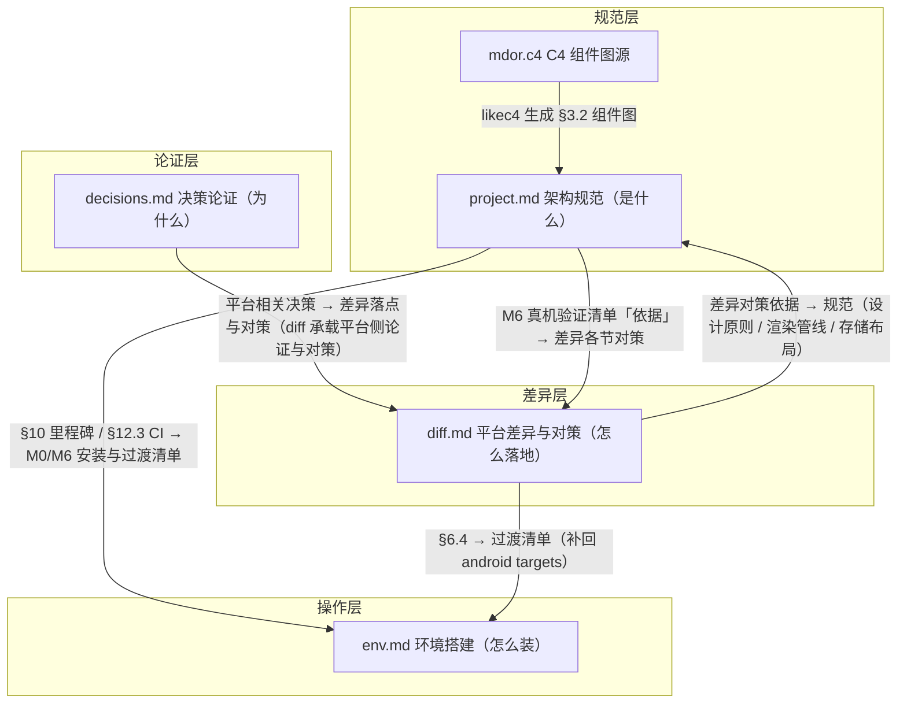

# doc/ 文档地图

mdor 项目文档索引。所有文档为规划稿，随实现推进持续更新。

| 文档 | 职责 | 何时读 |
|---|---|---|
| [project.md](project.md) | 架构总纲：目标、技术栈、分层、数据模型、核心模块、版本控制、存储布局、里程碑、CI | 一切起点 |
| [decisions.md](decisions.md) | 决策记录（ADR）：关键选型的背景 / 决策 / 依据 / 影响 | 遇到"为什么这么选"时查阅 |
| [diff.md](diff.md) | 跨平台差异：Windows 桌面 vs Android 的依赖点差异与对策 | 涉及平台差异 / 移植时 |
| [env.md](env.md) | 环境搭建：M0 桌面 / M6 Android 的安装、验收、排障、依赖升级 | 搭环境 / 升级工具链时 |
| [mdor.c4](mdor.c4) | C4 组件图源（LikeC4 DSL） | 修改架构组件关系时 |
| [script/scripts.md](../script/scripts.md) | script/ 脚本索引：各脚本用途与用法 | 使用/新增 script/ 下脚本时 |
| [AGENTS.md](AGENTS.md) | doc/ 写作约束（方案状态标记、L2 单详述源、文档存档） | 写/改 doc/ 前 |

**推荐阅读顺序**（新加入者）：README → project → diff → env；decisions 按需查阅。

## 文档间引用关系

四篇文档 + C4 图源构成"规范 → 论证 → 差异 → 操作"链路：

抽象层级自高而低：**规范（project）> 论证（decisions）> 差异（diff）> 操作（env）**；上层稳定，下层为具体易变的确定信息（版本 / 配置 / 平台对策 / ADR 状态），改动频率逐层升高——「确定信息单源」约定见 [doc/AGENTS.md](AGENTS.md#l2-单详述源)。

**引用方向要点**：

- **主题跨文档分布**：同一主题常在规范（project）、差异（diff）、论证（decisions）三处从不同视角呈现——如本地资源分发（[§6.5](project.md#65-renderservice) / [§2.3](diff.md#23-逐维度对比) / [D-04](decisions.md#d-04-本地资源分发)）、fsync 分层（[§6.7](project.md#67-元数据写入可靠性json不用-sqlite) / [§7.2](diff.md#72-mdor-的取舍已决策-2026-08-09按文件类型分层) / [D-03](decisions.md#d-03-原子写与-fsync-分层)）、gix 三坑（[§7](project.md#7-版本控制设计) / [§4.3-§4.5](diff.md#45-gix-三坑的配置规避机制梳理与待定讨论记录-2026-08-09) / [D-08](decisions.md#d-08-变更检测)[D-09](decisions.md#d-09-gix-三坑配置规避)）
- **里程碑关联**：project [§10](project.md#10-里程碑) 里程碑表 ↔ env 的 M0/M6 安装（[§1](env.md#1-环境总览与版本矩阵) / [§7](env.md#7-m0-到-m6-过渡清单补回-android-侧)）；project [§10.1](project.md#101-m6-真机验证清单) 验证清单 ↔ diff 各风险项依据
- **规范 ↔ 决策的摘要 / 「规范位置」反链**：为既定约定，图内不画箭头，见下方引用规范

## 引用规范

- 全文档引用一律用 **markdown 链接**，不用裸编号：
  - 跨文件：`[文本](文件名.md#标题锚点)`
  - 同文件：`[文本](#标题锚点)`
- 锚点 = 标题转小写，去除 `（）、·、/、.` 等标点，空格 → `-`，中文保留（GitHub slug 规则）。例如 `## 6.8 解析器安全对照（serde_json 选型依据）` → `#68-解析器安全对照serde_json-选型依据`
- 被抽取的决策统一收口到 [decisions.md](decisions.md)，规范文档只留摘要 + 链接
- 方案状态标记约定（行内简记 = 链接 `[【当前】 …](#锚点)`；块记 = 独立小标题 + admonition callout；`【当前】` / `【备选】` / `【已否决】` / `【已替换】`）见 [AGENTS.md](AGENTS.md#方案状态标记doc-写作约定)
- 锚点一致性检查：`uv run --directory script check-links.py`（扫描 `doc/` 下顶层全部 `.md` 文件、不递归；校验跨文件 + 站内锚点，跳过 fenced code block 与行内反引号代码；有不匹配即返回非零退出码）

## decisions.md 登记规则

- 每条 ADR 独立编号 `D-xx`，编号连续递增；标题不含 `、（）+` 等标点（保证锚点干净）
- 每条必填：**状态**（已决策 / 待定）/ **日期** / **规范位置**（反向链接）/ **背景** / **决策** / **依据** / **影响**
- 规范文档里凡涉及该决策处，用链接指向对应 D 编号，不重复粘贴论证
- 讨论未决项（如 M1 实测后才能敲定的）标"待定"，并列出验证项

## 再生成

C4 组件图：`likec4 gen mermaid . -o <输出目录>`（源为 [mdor.c4](mdor.c4)）
