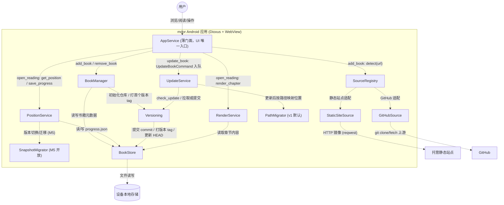
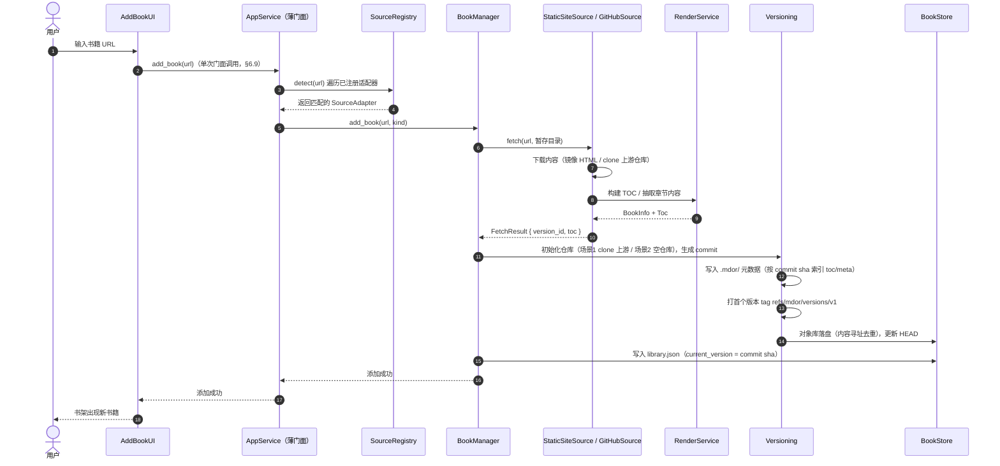
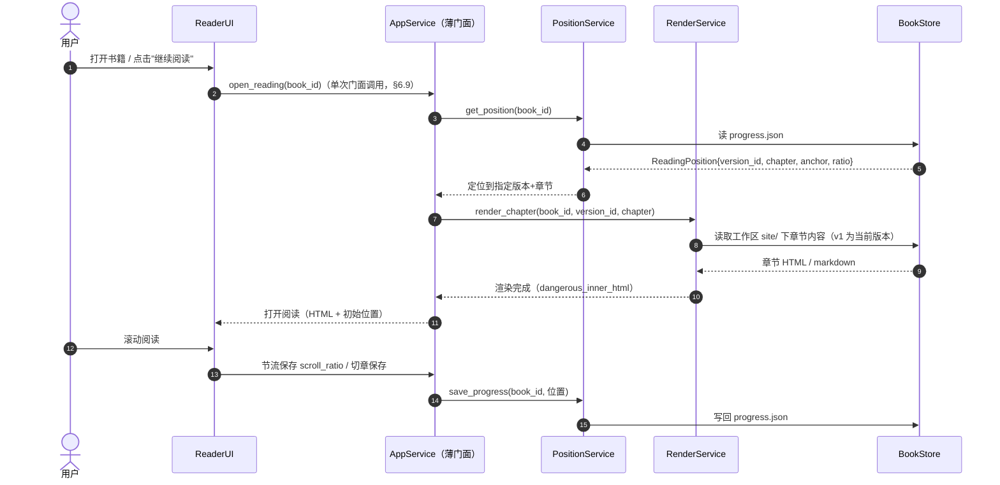
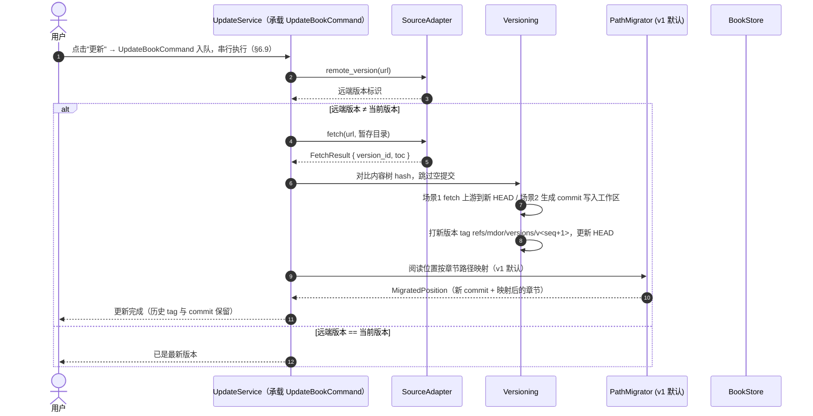
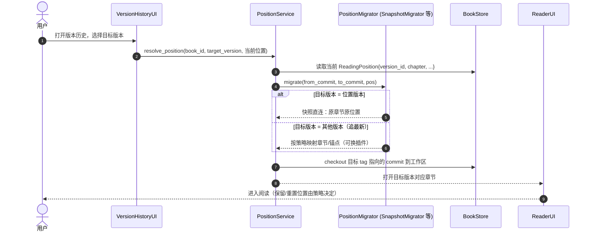

# mdor 项目架构文档

> 移动端 mdBook 离线阅读器 · Android · Rust + Dioxus
> 版本：0.1.0（规划稿）

---

## 1. 项目概述

### 1.1 目标

构建一个 **Android 移动端 mdBook 阅读器**，核心能力：

- 通过 **网址** 将远程文档下载到本地，离线阅读
- 支持两类输入来源：**GitHub 仓库（markdown 源文件）** 与 **托管静态站点（渲染好的 HTML）**
- 通过 **网址更新** 文档，并保留版本历史
- 记录 **阅读位置**（章节 + 滚动位置），支持书籍多版本阅读

### 1.2 技术栈

| 项 | 选择 | 说明 |
|---|---|---|
| 语言 | Rust (edition 2024) | 当前 1.97.1 |
| UI 框架 | Dioxus 0.7 | WebView 渲染，Android 一级支持 |
| 构建 | dioxus-cli (`dx`) | `dx serve --platform android` |
| HTTP | reqwest (rustls) | Android 无 OpenSSL 依赖 |
| HTML 解析 | scraper | 抽取 mdBook `<main>` 内容 |
| Markdown | pulldown-cmark | 渲染 GitHub markdown 源 |
| 序列化 | serde / serde_json | 元数据与进度存储；`serde_json` 内置 128 层递归深度限制（防深嵌套栈溢出 DoS）、无 RUSTSEC、Rust 内存安全（见 §6.7） |
| 存储 | 本地文件系统 + gix | JSON 元数据 + 每书一个 git 仓库 |
| 版本/去重 | gix | commit 图 + 版本 tag 承载版本关系，对象库内容寻址去重 |

### 1.3 非目标

- 不内嵌 mdBook 构建流程（不在设备上跑 `mdbook build`）
- 不做在线搜索 / 云同步（首版）
- 不做 iOS（Windows 平台无法构建）

---

## 2. 设计原则

1. **插件化输入**：所有文档来源（GitHub、静态站点、未来更多）通过统一的 `SourceAdapter` trait 接入，核心逻辑不感知来源差异。
2. **核心与 UI 解耦**：`core/` 为纯 Rust、平台无关，可在桌面直接 `cargo test`；`ui/` 为 Dioxus 界面。
3. **离线优先**：所有内容必须先落盘才可阅读，网络仅用于获取与更新。
4. **版本感知**：书籍内容按 git commit 管理，每次抓取/更新打一个版本 tag（指向 commit sha），版本关系由 commit 图承载；阅读位置绑定具体版本，可回放、可迁移。
5. **位置迁移可插拔**：版本间的阅读位置跳转策略做成插件；v1 默认实现为"路径映射"（更新追最新），后续可扩展其他策略（含多版本快照直连）。
6. **编排收敛（薄门面 + 按需命令化）**：UI 层只依赖一个应用门面 `AppService`，单次用户操作 = 单次门面调用，业务编排不泄漏进 UI；长流程（网络 + 多步 + 可中断 + 需进度/串行）封装为命令对象，经命令队列串行执行。**不引入全局中介者**——架构为分层树状，`UpdateService`/`PositionService` 本就是各自流程的中介者，再加全局 hub 会退化为上帝对象（见 §6.9）。

---

## 3. 总体架构

### 3.1 架构分层

```
┌──────────────────────────────────────────────────────────────┐
│                      UI 层 (Dioxus RSX)                      │
│   书架 LibraryUI · 添加 AddBookUI · 阅读 ReaderUI · 版本历史 │
├──────────────────────────────────────────────────────────────┤
│                      服务层 (Rust)                           │
│   AppService（薄门面，UI 唯一入口） · 命令队列串行执行       │
│   BookManager · SourceRegistry · UpdateService               │
│   PositionService · RenderService                            │
├──────────────────────────────────────────────────────────────┤
│                      核心/插件层 (Rust)                      │
│   StaticSiteSource · GitHubSource      (输入适配插件)        │
│   PathMigrator (v1 默认) · SnapshotMigrator (+ 预留)         │
│   Versioning · BookStore               (核心能力)            │
├──────────────────────────────────────────────────────────────┤
│                      设备存储 (本地文件系统 + gix)           │
│   library.json · progress.json                               │
│   books/<id>/  (git 仓库：.git 对象库 + 工作区 + 版本 tag)   │
└──────────────────────────────────────────────────────────────┘
```
### 3.2 C4 组件图



> 该图由 LikeC4 建模生成，源文件见 `doc/mdor.c4`（再生成：`likec4 gen mermaid doc -o <输出目录>`）。

### 3.3 UI 平台自适应设计（移动优先 + 桌面壳）

同一套 core 逻辑同时服务 Android（手机/平板）与 Windows 桌面；**自适应仅是 `mdor-app` UI 层的布局/交互差异，core 与业务逻辑零改动**（落地 §2 原则 2）。`mdor-app` 为 Dioxus WebView，视口宽度可直接读取（桌面为窗口宽度）。

- **移动优先（默认，≤600px）**：底部导航（书架/添加/设置）、全屏阅读、目录抽屉、手势操作（滑动返回、下拉刷新）；断点以视口宽度 600px 划分。
- **桌面壳（宽屏 ≥600px）**：左侧固定侧边栏（书架 + 目录树）、顶部工具栏、鼠标/键盘交互（快捷键、滚轮、右键菜单可选）；仅重建 UI 壳，`AppService` 句柄与阅读进度等状态不丢。
- **断点切换**：监听视口宽度变化（如窗口缩至手机宽度）即时切换导航壳，验证见 §10 M3。
- **输入适配**：添加书籍 URL——手机为文本输入 + 键盘；桌面支持快捷键聚焦与整段粘贴。URL 探测/校验仍在 core。
- **手势与系统能力（M6 真机）**：Android 返回键/安全区（WebView 内容避让状态栏与导航栏）、触摸滚动与 WebView 渲染性能，验证见 §10 M6。

---

## 4. 插件化输入架构

所有文档来源抽象为统一的 `SourceAdapter` trait，输入模块即为"插件"，通过 `SourceRegistry` 注册、按 URL 探测。

```rust
// core/source/mod.rs
#[derive(Clone, Copy, Debug, serde::Serialize, serde::Deserialize, PartialEq, Eq)]
pub enum SourceKind {
    StaticSite, // 托管静态站点：镜像 HTML
    GitHub,     // GitHub 仓库：拉取 markdown 源
}

#[async_trait]
pub trait SourceAdapter: Send + Sync {
    fn kind(&self) -> SourceKind;
    fn name(&self) -> &'static str;

    /// 探测：该适配器是否认识这个 URL
    fn detect(&self, url: &str) -> bool;

    /// 获取/刷新：从 URL 拉取内容写入 dest，返回书籍结构与版本标识
    async fn fetch(&self, url: &str, dest: &Path) -> Result<FetchResult>;

    /// 版本标识：返回当前远端版本字符串（GitHub: commit SHA；静态站: ETag/内容树 hash）
    async fn remote_version(&self, url: &str) -> Result<Option<String>>;
}

pub struct FetchResult {
    pub version_id: String,
    pub book: BookInfo,
    pub toc: Vec<TocEntry>,
}
```

### 4.1 内置适配器

| 适配器 | 输入 | 处理方式 |
|---|---|---|
| `StaticSiteSource` | `https://host/book/...` | 递归镜像同源页面/资源，保 mdBook 目录结构，抽取 `<main>`；抓取内容自建 git 链（场景 2） |
| `GitHubSource` | `https://github.com/user/repo[/tree/...]` | **git clone/fetch 上游仓库**（保留上游历史），解析 `src/SUMMARY.md` 建 TOC，工作区即上游文件，`pulldown-cmark` 渲染；拉取点打版本 tag（场景 1） |

### 4.2 添加书籍流程（序列图 SD-1）



---

## 5. 数据模型

```rust
/// 书架上的书籍元数据（library.json 中每条）
#[derive(Serialize, Deserialize, Clone)]
pub struct Book {
    pub id: String,              // book_id，由来源 URL 派生
    pub source_kind: SourceKind,
    pub url: String,             // 原始网址（用于更新）
    pub title: String,
    pub current_version: String, // 当前版本（HEAD commit sha）
    pub added_at: i64,
    pub updated_at: i64,
}

/// 一次获取的内容快照（书籍的一个版本；由 tag refs/mdor/versions/<seq> 标记）
pub struct VersionSnapshot {
    pub version_id: String,      // 版本 tag 指向的 commit sha
    pub workdir: PathBuf,        // 仓库工作区（场景1: 上游文件；场景2: books/<id>/site/）
    pub toc: Vec<TocEntry>,      // 章节树（存于 .mdor/versions/<sha>.json，未被 git 跟踪）
    pub meta: SnapshotMeta,      // 获取时间、来源版本标识、内容树 hash
    // 版本标记 = 私有 tag（refs/mdor/versions/<seq>）；parent 由 commit 图派生，不单独存储
}

/// 阅读位置 —— 与具体版本绑定
#[derive(Serialize, Deserialize, Clone)]
pub struct ReadingPosition {
    pub book_id: String,
    pub version_id: String,      // 位置所属版本（commit sha；v1 更新时被 path 迁移改写）
    pub chapter_path: String,    // 章节路径（TOC 中的相对路径）
    pub heading_anchor: Option<String>, // 标题锚点（mdBook 输出自带）
    pub scroll_ratio: f32,       // 章节内滚动比例 0.0~1.0
    pub saved_at: i64,
}

/// 位置迁移结果
pub struct MigratedPosition {
    pub target_version: String,
    pub target_chapter: String,
    pub target_anchor: Option<String>,
    pub strategy: MigrateStrategy, // 见 §8
}
```

---

## 6. 核心模块

### 6.1 BookManager
书籍生命周期编排：`add_book`、`remove_book`、`update_book`。不感知来源差异，统一走 `SourceRegistry` + `Versioning`。

### 6.2 SourceRegistry
注册表 + 工厂：持有 `Vec<Box<dyn SourceAdapter>>`，`detect(url)` 依次询问。新增来源 = 新增一个实现 `SourceAdapter` 的插件模块并注册，核心与 UI 零改动。

### 6.3 UpdateService
更新编排：更新流程封装为 `UpdateBookCommand`（§6.9），经命令队列串行执行（见 §7.3 SD-3）。

### 6.4 PositionService
阅读位置读写（`progress.json`），以及调用 `PositionMigrator` 完成版本间位置迁移（见 §8）。

### 6.5 RenderService
统一渲染管线：
- `StaticSite` 路径：读取章节 HTML → `scraper` 抽取 `<main id="content">` → 重写资源链接为本地绝对 URL（`http://127.0.0.1:PORT/books/<id>/<path>`，不带版本号，两端统一走本地 http 服务，见 `doc/diff.md` §2.3）→ `dangerous_inner_html` 注入
- `GitHub` 路径：读取 `.md` → `pulldown-cmark` → HTML → 同一注入管线
- 内联书籍 CSS，保证代码高亮等样式一致

### 6.6 离线阅读 + 进度恢复（序列图 SD-2）



### 6.7 元数据写入可靠性（JSON，不用 SQLite）

几十本书量级的元数据总量 < 100KB，访问形态为按 `book_id` 的简单读写、单进程单写者（串行化即可），无关系查询需求——**JSON 文本足够，不引入 SQLite**（避免 C 依赖/Android 交叉编译复杂度与 schema 迁移，保持依赖纯 Rust）。可靠性由以下约定保证：

| 场景 | 风险 | 解法 |
|---|---|---|
| 写入一半被杀（滚动存进度） | 文件损坏 | **原子写**：写 `*.tmp` + 同目录 `rename` 覆盖（Android/Linux 上原子），要么旧文件要么新文件，无半写状态 |
| 启动读到坏文件 | 无法解析 | 覆盖前保留 `.bak`，启动解析失败回退备份 |
| `add_book`/更新多步中断（建仓库 → 写 `.mdor/` → 写 `library.json`） | 半完成状态 | `library.json` **最后写** = 提交点：中断后书架无此书/仍为旧版本；孤儿 `books/<id>/` 目录启动时清理 |
| 断电/内核崩溃 | rename 未落盘 | fsync 兜底：**按文件类型分层**——`library.json` 做 fsync（低频高价值），`progress.json` 仅 rename（高频低价值，见 `doc/diff.md` §7.2） |

- 原子写封装为 `store` 内工具函数 `write_json_atomic(path, &data, durability)`，`durability` 为 `Fsync` / `RenameOnly`，调用方按文件类型传（`library.json` → Fsync；`progress.json`、versions 元数据 → RenameOnly），不按平台分支，core 平台无关
- 读取统一走 `read_json_capped(path, MAX_META_BYTES)`：**读文件前按字节数上限拦截**（默认 1MB，远超正常元数据量级），把"超大文档耗尽 CPU/内存"这类 DoS 彻底关死（纵深防御，见 §6.8）
- 此策略适用于 `library.json`、`progress.json`；`.mdor/versions/<sha>.json` 为只增写、失败可重写，同样走原子写

### 6.8 解析器安全对照（serde_json 选型依据）

选型时逐项对照了其他 JSON 解析器生态近期公开的漏洞，结论：**以下均为 Java/C 生态问题，`serde_json` 不受影响**。

| 漏洞 | 属于 | 漏洞本质 | 对 `serde_json` 的适用性 |
|---|---|---|---|
| CVE-2026-18401（Jackson-core 异步解析器数字长度绕过） | Java | 非阻塞/异步解析路径漏掉 `maxNumberLength` 校验 → 无限分配 + O(n²) 大数解析 → DoS | 无此类"异步流式解析"API；本项目只用 `from_str` 整块解析自有小文件，不适用 |
| CVE-2026-29062（Jackson-core 嵌套深度限制绕过） | Java | `DataInput`/`Reader` 路径漏掉 `maxNestingDepth` 校验 → 栈溢出 DoS | **已内置防护**：`from_str` 路径默认 128 层递归限制（serde_json PR #163），无已知绕过通告；仅有的 serde#3023 边缘情况（`IgnoredAny` 处理程序构造的 10 万层 `Value`）在本项目"解析自有 <100KB 元数据"的流程中不可达 |
| CVE-2026-9563（Eclipse Parsson 无文档大小上限） | Java | 无默认 max 文档大小 → 超大文档耗尽 CPU/内存 | serde_json 默认同样无大小上限（各主流解析器共性），其危害前提是"解析攻击者可控的网络 JSON"——本项目解析的是**应用自生成的本地元数据**；另以 `read_json_capped()` 1MB 读入 guard 补齐纵深防御 |
| QVD-2026-45876（Fastjson2 反序列化 RCE） | Java | `@type` AutoType 哈希碰撞绕过白名单 + `jar:` URL 类加载 → RCE | **结构性不可能**：Rust/serde 无多态反序列化——JSON 无 `@type` 机制、不从 JSON 加载类、无反身构造副作用，`Deserialize` 全为编译期实现，反序列化无法触发任意代码 |
| USN-7973-1（cJSON 多个内存安全漏洞） | C | OOB 读/写、大数 DoS | 内存安全由 Rust 语言保证（`serde_json` unsafe 极少、无 OOB）；大数解析进 `f64`/`i64`/`u64`，无放大性分配 |

**结论**：异步限制绕过/深度绕过/RCE/内存安全这几类 Java/C 生态漏洞，在 `serde_json` + Rust 内存模型下结构性不适用；唯一设计上同源的"无文档大小上限"以读入 guard 补齐。依赖层面的"无已知未修复漏洞"由 `cargo audit`（§12.1）持续验证。

### 6.9 服务编排：薄门面 + 按需命令化

调用关系上做两件事，避免"UI 直接认识多个服务、一次操作多次跨层调用"（落地 §2 原则 2 / 原则 6）：

**薄门面（Facade，v1 即生效）**：UI 层只依赖 `AppService` 一个入口，单次用户操作 = 单次门面调用，协调细节全部收敛在门面内：

- `add_book(url)`：把 SD-1 的 `detect(url)` + `add_book(url, kind)` 合并为一次调用（UI 不再触达 `SourceRegistry`）
- `open_reading(book_id)`：把 SD-2 的"读位置 + 渲染章节 + 保存进度"合并为一次调用（UI 不再触达 `PositionService`/`RenderService`）

效果：UI 依赖数从 O(服务数) 降到 O(1)；业务编排不泄漏进 Dioxus 屏幕，"`mdor-app` 只做『拿到 HTML 注入 + 交互』"（§12.1）由门面兜底。

**命令化（Command，按需引入）**：按流程特征区分两类，不全局套壳：

| 流程特征 | 处理方式 |
|---|---|
| 短、无网络、无并发、无进度需求 | 普通函数（删除书籍、progress.json 读写） |
| 长 + 网络 + 可中断 + 需进度/串行 | 命令对象（更新书籍，SD-3） |

命令把"一次更新"封装为数据对象 `UpdateBookCommand`，统一实现 `Command` trait、经命令队列串行执行：

- **串行化**：队列一次只执行一条，天然落实 §6.7"单进程单写者"
- **进度上报**：`progress()` 暴露当前阶段（检查/下载/提交/迁移），UI 订阅显示"正在更新…"
- **中断续做**：命令携带执行阶段，Android 切后台/被杀后重试可跳过已完成步骤（如工作区已写好则不再下载）；完整断点续传不在命令范围内
- **可测试**：命令边界单一（"完成一次更新"），注入假适配器即可单测（httpmock，见 §12.2）

```rust
// core/services/commands/mod.rs
pub trait Command {
    type Output;
    /// 执行一次完整流程；ctx 持有全部模块句柄
    async fn execute(&self, ctx: &AppContext) -> Result<Self::Output>;
    /// 当前阶段（检查/下载/提交/迁移），供 UI 订阅
    fn progress(&self) -> Option<Progress> { None }
}

// 命令队列：一次只执行一条（串行化 = §6.7 单写者）
while let Some(cmd) = queue.recv().await {
    cmd.execute(&ctx).await?;
}
```

**v1 边界**：仅"更新书籍"（SD-3）命令化；"添加书籍"（SD-1）先拆命名函数（`check_latest` / `fetch_to_temp` / `commit_and_tag` / `migrate_and_save`），出现并发/进度需求再升级为命令。

**为什么不用全局中介者**：架构为分层树状（UI→服务→核心叶子，服务间几乎无互调），`UpdateService`/`PositionService` 本就是各自流程的中介者；再引入全局 hub 会令所有模块反向依赖一个中央对象，流程变隐式、难以测试与定位——是净负收益。

---

## 7. 版本控制设计

### 7.1 版本标识

两场景统一：**`version_id` = tag 指向的 commit sha**；用户可见的"版本" = 私有命名空间 tag `refs/mdor/versions/<seq>`。

| 来源 | commit 来源 | 说明 |
|---|---|---|
| GitHub（场景 1） | 上游仓库 commit | clone/fetch 上游历史，拉取点在最新 HEAD 打版本 tag，不向上游写任何内容 |
| 静态站点（场景 2） | 自建 commit | 每次抓取 = 一个 commit（parent=HEAD），随即打版本 tag |

### 7.2 快照模型（git 基座 + tag 统一版本）

- 每本书是一个由 gix 管理的 git 仓库：`books/<id>/`（对象库 `.git/` + 工作区）
  - **场景 1**：仓库 = 上游仓库克隆，历史原样保留（`git log`/`git diff` 直接可用），我们只加 tag、不 commit
  - **场景 2**：仓库 = 自建链，每次抓取一个 commit
- **用户版本 = tag**（`refs/mdor/versions/<seq>`，序号单调递增，避免与上游自身 tag 冲突），`version_id` = tag 指向的 commit sha
- 每次内容有变化的抓取/更新：场景 1 打新 tag、场景 2 生成 commit 并打新 tag；内容树 hash 未变化时跳过，不产生空提交
- 对象库天然**内容寻址去重**：跨版本未变的文件只存一份（blob/tree 复用），无需额外去重机制
- `HEAD` 即当前版本，`current` 语义由 git ref 承载；版本列表 = 列 `refs/mdor/versions/*`
- 历史版本读取 = **按需 checkout 目标 commit 到工作区**（单一工作区、原地覆盖，无空间累加）
- 书籍元数据（`.mdor/`：toc/meta，按 commit sha 索引）位于仓库根下但**未被 git 跟踪**，两场景都不污染历史

### 7.3 更新流程（序列图 SD-3）



### 7.4 存储基座：为何 v1 起就用 gix

**结论：v1 起即以 gix（纯 Rust 的 git 实现）作为存储基座，每书一个 git 仓库，并以私有 tag 记录版本。** 版本历史 UI、多版本阅读、数据同步都不是 v1 功能，但存储基座一旦选定就应指向长期正确的那个——版本 tag 随每次抓取/更新**自然积累**，将来只需开放功能，而不用回头改造存储层。

**为什么是 git/gix 而不是"目录快照 + 手写版本链"：**

- commit 承载内容快照、commit 图承载历史关系、**tag 承载"版本"语义**、ref（HEAD）= 当前指针、内容寻址对象库 = 去重与校验——版本管理需要的每一件事都被 git 封装好了；自己用目录 + `index.json` 实现，等于重写一个简化且不完整的 git
- 历史版本读取 = 按需 checkout 到单一工作区，与日常 `git checkout` 完全一致，无空间累加
- 未来若做**数据同步**，git 协议（fetch/push、partial clone 按需懒加载 blob）直接复用，无需自建传输层

**诚实成本（gix 封装掉了解析，剩下的工程成本）：**

| 成本项 | 说明 | 应对 |
|---|---|---|
| 依赖体积/内存 | gix 依赖树大，Android 上编译时间、APK 体积、内存上升 | 按需裁剪 feature；每书独立小仓库，控制单仓对象库规模 |
| 写路径 | 由"复制目录"变为"一次 commit"（gix 封装，无解析负担） | 场景1 只 fetch+打 tag、不 commit；场景2 直接使用 `gix` 高层 API（`commit` / tree / blob 读取） |
| 读历史版本 | checkout 目标 commit 到工作区；从对象库直接读 blob 为非必要优化 | 版本功能开放时按切换频率实测二选一 |
| GC / 清理 | 初期"删除版本" = 仅删 tag，不清理 git 历史；后续真回收磁盘需 shallow 截断 + gc | 初期两场景一致（只删 tag）；shallow 回收延后，两场景统一作为用户设置项 |

**被否定的替代方案：**

- **全量目录快照 + COW 硬链接 + `index.json` 版本链**（早期规划）：需手写版本关系、去重、原子性，且无同步传输能力；空间收益（文件级去重）被 gix 对象库天然覆盖
- **git2（libgit2）**：C 依赖，Android 交叉编译麻烦，排除
- **blob 直接读（对象解析桥）作为历史读取主路径**：不必要——单一工作区 checkout 已满足"切状态阅读"，且不占额外空间（该能力现定义为与工作区直读互斥的可选资源通道，见 §12.1；v1 默认不引入，历史读取仍走 checkout）

> 版本 tag 机制自 v1 生效（每次抓取/更新都打 tag，能力自然积累）；版本 UI / 多版本阅读（方案 D）/ 数据同步为后续里程碑开放的功能（见 §8、§10），开放时无需改造存储层，只需新增读取与展示。

---

## 8. 阅读位置在版本变动后的处理方案

### 8.1 设计决策

**v1 行为（更新追最新，`path` 策略）**：v1 不开放版本历史 UI。更新后阅读位置**按章节路径映射**到新版本（`chapter_path` 不变则直连，章节消失则 TOC 顺序回退相邻章节）；位置在更新时即迁移，不存在"读旧版"路径。

**方案 D（版本快照绑定）为后续开放（M5）**：阅读位置与具体 commit 强绑定：

- 记录时绑定 `version_id`（commit sha，该记录的位置必然可回放）
- 更新后，位置仍指向旧版本 commit；用户从书架打开时，**默认继续读旧版本对应位置**，进度零丢失
- 支持同一文档**多版本并行阅读**（版本历史界面选择任意版本）
- 版本切换 = 按需 checkout 目标 tag 指向的 commit 到工作区；版本列表 = 列 `refs/mdor/versions/*`；清理策略（保留最近 N 版）在版本功能开放时实现

### 8.2 插件化迁移架构

实际"跳转"行为做成插件，未来可让用户选择不同策略。当前内置 `path`（v1 默认），其余后续逐个加入。

```rust
// core/migration/mod.rs
#[async_trait]
pub trait PositionMigrator: Send + Sync {
    fn id(&self) -> &'static str;
    fn name(&self) -> &'static str;
    /// 将旧版本位置迁移到目标版本（可能返回"保持旧版本"）
    async fn migrate(
        &self,
        from: &VersionSnapshot,
        to: &VersionSnapshot,
        pos: &ReadingPosition,
    ) -> Result<MigratedPosition>;
}
```

### 8.3 插件清单

| 插件 id | 名称 | 状态 | 行为 |
|---|---|---|---|
| `path` | PathMigrator | **内置（v1 默认）** | 按 `chapter_path` 直接映射到新版本，路径消失则 TOC 顺序回退相邻章节 |
| `snapshot` | SnapshotMigrator | 预留（M5 开放） | 位置绑定旧版 commit，旧版本仍在 → 迁移结果即"读旧版原位置"；若用户选择追最新，则按 TOC 同名路径映射 |
| `anchor` | AnchorMigrator | 预留 | 增加标题锚点映射，锚点消失回退章节开头，标题改动用模糊匹配 |
| `fingerprint` | FingerprintMigrator | 预留 | 记录阅读位置附近文本指纹，新版本全文检索命中后精确定位 |

> v1 更新默认用 `path` 追最新；方案 D（多版本阅读 + 快照直连，M5）保证"永不丢位置"；其余插件是"用户主动追最新版"时的可选策略，将来通过设置界面选择。

### 8.4 版本切换 / 位置迁移（序列图 SD-4，M5 开放）



---

## 9. 存储布局

```
<数据根>/                        # 平台相关，仅此层不同（见下方注记）
└── data/
    └── bookstore/               # BookStore::new(base_dir) 注入点；其他数据类型可平级加目录
        ├── library.json         # 书架元数据（Book 列表 + current_version = HEAD commit sha）
        ├── progress.json        # 阅读位置（ReadingPosition 按 book_id 索引）
        └── books/
            └── <book_id>/       # gix 管理的 git 仓库（场景1: 上游克隆；场景2: 自建链）
                ├── .git/        # 对象库 + refs（含版本 tag refs/mdor/versions/<seq>，内容寻址去重）
                ├── src/, book.toml ...  # 工作区（场景1: 上游 mdBook 源文件；场景2: 镜像内容于 site/）
                ├── site/        # 工作区（场景2: 当前版本镜像内容，webview 直接读文件）
                └── .mdor/       # 书籍元数据（仓库根下但未被 git 跟踪）
                    └── versions/
                        └── <commit sha>.json  # 每版本 toc/meta（按 commit sha 索引）
```

- 用户版本 = 私有 tag `refs/mdor/versions/<seq>`；版本列表 = 列 tag；`current` 语义即 git `HEAD`
- `.mdor/` 未被 git 跟踪：toc/meta 按 commit sha 索引，两场景都不污染仓库历史（场景1 尤其关键——克隆的上游历史不被任何附加 commit 改动）
- 历史版本读取 = 按需 checkout 目标 tag 指向的 commit 到工作区（单一工作区，无空间累加）
- 应用级元数据（`library.json`/`progress.json`）位于仓库之外，避免与版本内容混存

> `<数据根>` 平台相关：Android 通过 `android_activity`/JNI 取 `getFilesDir()`（应用私有目录）；Windows 用 `std::env::current_exe()` 取 **exe 同目录**（便携式：不存在则 `create_dir_all`，**目录不可写直接报错，不回退**到系统用户目录）。core 只见 `bookstore/` 这一层，数据根解析在 `mdor-app` 启动时 cfg 分支完成。

---

## 10. 里程碑

| 阶段 | 内容 | 验证方式 |
|---|---|---|
| **M0** | 桌面开发环境搭建（VS/MSVC、rust-toolchain、dioxus-cli；android targets/JDK/SDK/NDK 留待 M6） | `dx serve --platform desktop` 跑通 |
| **M1** | 脚手架：core 模块 + trait + 存储层（gix 基座）+ 书架骨架（中文 UI）+ 挂轻量 `ci.yml`（fmt/clippy/test/audit） | `cargo run` / `cargo test` / CI 全绿 |
| **M2** | `StaticSiteSource` + 递归镜像下载 | 用真实 mdBook 站点离线镜像 |
| **M3** | 阅读器：内容抽取、资源协议、目录抽屉、滚动进度 | 桌面全流程 + 自适应布局验证（窗口缩至手机宽度） |
| **M4** | `GitHubSource`：git clone/fetch 上游仓库（保留历史）+ SUMMARY 解析 + markdown 渲染 | 真实仓库测试 |
| **M5** | 版本功能开放：版本历史 UI + 按需 checkout 多版本阅读 + SnapshotMigrator（方案 D）+ 清理策略（初期删版本 tag；后续 shallow 截断 + gc 为可选设置项，两场景统一） | 修改源站后更新，验证旧版本位置可回放 |
| **M6** | Android 打包（APK）、权限/存储目录/cleartext 配置 | 模拟器/真机验证 + 真机触控交互验证（滑动/返回/安全区/WebView/性能） |
| **M7** | CI 与发布（GitHub Actions）：设计补充 + 落地 `ci.yml`（core-quality / windows-desktop-check / android-check）+ `release.yml`（tag 触发，签名 APK + Windows 桌面 exe）+ CI 与本地工具链解耦说明 | 打一个 tag 触发 CI 产出双平台 artifact；PR 自动跑质量与双平台编译检查 |

---

## 11. 风险与待定项

| 风险/待定 | 影响 | 应对 |
|---|---|---|
| 本地资源分发通道（原"wry 自定义协议在 Android 的兼容性"） | 阅读页图片/资源加载 | **已决策（2026-08-09）**：两端统一本地 `tiny_http` 服务器 + `http://127.0.0.1:PORT` 绝对 URL；自定义 scheme 降级为后续可选，见 `doc/diff.md` §2.3/§2.4 |
| Android 数据目录获取 | 存储路径 | JNI `getFilesDir()`；桌面走 exe 同目录 `data/`（便携式） |
| mdBook 高级扩展（`{{#playground}}`、LaTeX、mermaid） | GitHub 源渲染保真度 | 首版仅支持 `{{#include}}`，其余列出 |
| `dangerous_inner_html` 不执行 `<script>` | 搜索/导航原生 JS 失效 | 由 Dioxus 自绘 TOC/导航替代（预期行为） |
| gix 依赖体积/内存（Android） | APK 大小、启动内存 | 按需裁剪 gix feature；每书独立小仓库控制对象库规模 |
| checkout 切版本与 webview 渲染协调 | 切版本时工作区文件被替换 | 先加载章节到内存再切换，或切换后 reload |
| gix 在 Android 的可用性 | 存储基座能否正常跑 | M1 桌面验证 + M6 真机验证 |
| 版本历史的存储占用 | 设备空间 | gix 对象库内容寻址去重；保留最近 N 版初期只删版本 tag（历史与对象保留），后续磁盘回收统一做 shallow 截断 + gc（用户可选设置） |
| 上游仓库体积 / Git LFS | 场景1 磁盘占用与图片渲染 | 依赖 gix 对象去重；LFS 仓库 clone 仅得指针文件，首版提示暂不支持 |
| 静态站点镜像边界 | 防止越界爬取 | 限同源 + 深度/大小上限 |
| 大小写碰撞物理冲突（`Foo.md` vs `foo.md`） | Windows NTFS 只能落一个文件 | tree 级检测（平台无关）；同 blob 归一；异 blob 两选项（双渲染+标注 默认 / 报错）；Windows 接受单渲染+标注退化；跨平台真双渲染绑定可选"blob 直接读"能力（§12.1，默认不引入） |

---

## 12. 项目文件结构

采用 **Cargo workspace** 承载 core / ui 分层（对应 §2 设计原则 2）。`mdor-core` 为纯 Rust、平台无关库，桌面可直接 `cargo test`；`mdor-app` 为 Dioxus UI 二进制（`dx` 构建目标）。输入适配器与位置迁移插件均为 core 内模块、编译期注册（对应 §4 / §8）。

```
mdor/
├── Cargo.toml                 # [workspace] members + [workspace.dependencies] 统一锁定依赖版本
├── rust-toolchain.toml        # 固定 1.97.1（M0 不装 android targets；M6 补回 arm64-v8a / x86_64，见 env.md §7）
├── .gitignore                 # /target、mobile/android 构建产物、fixtures 下载缓存
├── README.md
├── doc/                       # 本架构文档、mdor.c4 等
│
├── crates/
│   ├── mdor-core/             # 纯 Rust 库，平台无关，桌面可直接 cargo test
│   │   ├── Cargo.toml
│   │   └── src/
│   │       ├── lib.rs
│   │       ├── error.rs               # 统一错误类型
│   │       ├── model/                 # §5 数据模型（纯数据，无 IO）
│   │       │   ├── book.rs            #   Book
│   │       │   ├── snapshot.rs        #   VersionSnapshot / SnapshotMeta
│   │       │   ├── toc.rs             #   TocEntry
│   │       │   └── position.rs        #   ReadingPosition / MigratedPosition
│   │       ├── store/                 # §6.6/6.7 BookStore：文件系统持久化（§9 存储布局，JSON 原子写）
│   │       │   ├── mod.rs             #   BookStore 聚合入口，base_dir 注入
│   │       │   ├── util.rs            #   write_json_atomic + read_json_capped（§6.7 原子写，durability 按文件类型，1MB 读入 guard）
│   │       │   ├── library.rs         #   library.json 读写（原子写，提交点）
│   │       │   ├── progress.rs        #   progress.json 读写（原子写）
│   │       │   └── snapshot.rs        #   git 仓库快照：clone/fetch 上游（场景1）/ 自建链 commit（场景2）、版本 tag 管理、工作区 checkout（gix）
│   │       ├── source/                # §4 输入插件（编译期注册）
│   │       │   ├── mod.rs             #   SourceKind / SourceAdapter trait / FetchResult
│   │       │   ├── registry.rs        #   SourceRegistry（detect 遍历）
│   │       │   ├── static_site.rs     #   StaticSiteSource：递归镜像 + <main> 抽取（自建链）
│   │       │   └── github.rs          #   GitHubSource：git clone/fetch 上游 + SUMMARY 解析 + md 渲染
│   │       ├── versioning.rs          # §7 commit/版本 tag 生成、HEAD/ref 维护、对象去重（gix 对象库）
│   │       ├── migration/             # §8 位置迁移插件
│   │       │   ├── mod.rs             #   PositionMigrator trait
│   │       │   ├── path.rs            #   PathMigrator（v1 更新默认，按章节路径映射）
│   │       │   └── snapshot.rs        #   SnapshotMigrator（方案 D，M5 开放）
│   │       ├── render/                # §6.5 RenderService 统一渲染管线
│   │       │   ├── mod.rs             #   render_chapter 入口
│   │       │   ├── html_extract.rs    #   scraper 抽 <main> + 资源链接重写
│   │       │   ├── markdown.rs        #   pulldown-cmark → HTML
│   │       │   └── resources.rs       #   本地资源 URL 路由（URL→文件路径映射，可插拔自定义 scheme，见 diff.md §2.3）
│   │       └── services/              # §6 服务编排层（§6.9 薄门面 + 命令化）
│   │           ├── app_service.rs     #   AppService：UI 唯一门面（add_book / open_reading 等聚合入口）
│   │           ├── book_manager.rs    #   add/remove/update 编排
│   │           ├── update_service.rs  #   更新编排（承载 UpdateBookCommand，§7.3 SD-3）
│   │           ├── position_service.rs#   进度读写 + 迁移调用（§8.4 SD-4）
│   │           └── commands/          #   §6.9 命令对象（队列串行执行 + 进度上报）
│   │               ├── mod.rs         #   Command trait + 命令队列
│   │               └── update_book.rs #   UpdateBookCommand（SD-3 流程命令化）
│   │
│   └── mdor-app/              # Dioxus UI 二进制（dx 构建目标）
│       ├── Cargo.toml
│       ├── Dioxus.toml        # [application] [android] [asset] 配置，dx serve --project 指向此目录
│       ├── assets/            # CSS / 字体 / 图标（dx 打包资源）
│       ├── mobile/            # dx 生成的 Android 原生工程（构建产物，勿手改）
│       └── src/
│           ├── main.rs        # dioxus::launch 入口 + Android getFilesDir()/桌面 exe 同目录路径解析
│           ├── app.rs         # Router + 主题
│           ├── state.rs       # GlobalSignal：AppService 句柄、当前书籍/版本
│           ├── screens/       # §3.1 UI 四屏
│           │   ├── library.rs #   书架
│           │   ├── add_book.rs#   添加书籍
│           │   ├── reader.rs  #   阅读（dangerous_inner_html + 滚动节流存进度）
│           │   └── versions.rs#   版本历史
│           └── components/    # 抽屉、列表、按钮等复用组件
│
└── fixtures/                  # 测试样例（core 集成测试用，不随包发布）
    ├── mdbook-static/         # 预构建的静态 mdBook 站点（M2 镜像测试）
    └── github-sample/         # 带 SUMMARY.md 的 markdown 仓库样例（M4 解析测试）
```

### 12.1 关键设计决策

- **数据目录注入而非硬编码**：`BookStore::new(base_dir)` 接收路径；`mdor-app` 启动时按平台解析数据根——Android 走 JNI `getFilesDir()`，Windows 走 `std::env::current_exe()` 的 **exe 同目录**（便携式：`data/bookstore` 不存在则创建，不可写直接报错，不回退到系统用户目录），core 保持平台无关（对应 §11 风险项）。
- **核心与 UI 解耦验证**：全部业务逻辑（含渲染管线）在 core，`mdor-app` 只做「拿到 HTML 注入 + 交互」；验证方式即 `cargo test -p mdor-core` 桌面直跑。
- **薄门面 = UI 唯一入口**：UI 层只依赖 `AppService`，单次用户操作 = 单次门面调用（`add_book(url)`、`open_reading(book_id)`），detect / 版本定位 / 进度保存等编排收敛在门面内，UI 依赖数从 O(服务数) 降到 O(1)。不引入全局中介者——架构为分层树状、服务间几乎无互调，`UpdateService`/`PositionService` 已是各自流程的中介者，再加全局 hub 会成上帝对象（见 §6.9）。
- **长流程命令化 = 按需而非全局**：命令对象封装"一次完整流程"，经命令队列串行执行（落实 §6.7 单写者），可汇报进度、可携带中断点（重试跳过已完成步骤）。v1 仅"更新书籍"（SD-3）命令化；短流程（删除书籍、progress 读写）保持普通函数；"添加书籍"先用拆命名函数（§6.9）。
- **本地资源分发（已决策 2026-08-09）**：阅读页本地资源两端统一经 app 侧本地 `tiny_http` 服务器分发（`http://127.0.0.1:PORT` 绝对 URL），核心放 `render/resources.rs`（URL→文件路径映射，可插拔）；自定义 `mdor-book://` 为后续可选功能。渲染形态 = `dangerous_inner_html` 注入（不用 iframe）。依据与背景见 `doc/diff.md` §2.3/§2.4。
- **资源读取通道可插拔 + blob 直接读为可选能力（互斥二选一，默认工作区直读）**：默认通道 = **工作区直读**（`render/resources.rs` 的 URL→文件路径映射，本地 `tiny_http` 读磁盘字节）；**blob 直接读**（URL→blob oid，从 git 对象库读字节）为可选能力，与工作区直读**互斥、不并行**——要么这个要么那个，最多做成插件化通道，经设置选项二选一。该能力绑定的收益：① 大小写碰撞边界（`Foo.md`/`foo.md`）的跨平台一致——默认工作区直读时 Windows（NTFS 只能落一个文件）接受"单渲染+标注"退化（`doc/diff.md` §4.5.5-3），开启 blob 直接读后两端都能真双渲染；② 顺带复用：历史版本直接服务（`doc/diff.md` §2.3"未来可加回"的 `<version>` 寻址）与数据同步懒加载 blob（§7.4）。现状：v1 不引入，保持工作区直读。
  - **接口可行性（gix 现成）**：读 blob 是 gix 一等公民——`repo.find_blob(oid)` → `Blob { data: Vec<u8> }`（另有 `FindExt::find_blob(id, &mut buf)` 复用 buffer）；路径→oid 用 `repo.tree(id).traverse()`（或 `find_tree_entry_by_path`）；pack 解压/delta 链解析已由 gix 封装。实现复杂度集中在**映射与缓存**，不在读取本身：`resources.rs` 的 URL→规范化路径逻辑不变，只多一步"路径→oid"（v1 服务 HEAD 的 tree，或 ingest 时预建 path→oid 索引），缓存用 gix buffer 复用 API；资源服务器改为持有 gix 对象访问即可，通道接口不变（互斥二选一正是可插拔预留点）。**收益**：① 碰撞边界跨平台一致（Windows 真双渲染）；② 服务字节=对象库权威字节，无工作区竞态（§2.3"声称值 vs 保证值"消解）；③ 免 checkout 服务任意版本（M5 铺路）；④ 与同步懒加载 blob（§7.4）复用同一能力；⑤ 渲染不受 Windows checkout 的路径长度/大小写坑影响。**代价**：对象库读取慢于文件读（大内容需缓存）；服务器引入对象访问（gix 本就是 core 依赖）；与工作区直读互斥、经选项切换，不并行。
- **异步运行时**：core 用 tokio；reqwest 配 rustls（Android 无 OpenSSL）。
- **依赖版本统一**：reqwest / scraper / pulldown-cmark / serde / gix 等在根 `[workspace.dependencies]` 钉一次。
- **依赖安全审计 = `cargo audit`（零配置）**：本地定期或 CI 跑，对照 RustSec Advisory Database（RUSTSEC），保证"无已知未修复漏洞"可持续验证而非一次性判断；漏洞存在时退出码非 0。**不引入 `cargo deny`**：许可证合规（licenses）对离线阅读器非刚需、来源检查（sources）冗余（依赖全来自 crates.io 且 `Cargo.toml` 自持）。若日后关心 APK 体积，用 cargo 自带 `cargo tree -d` 按需排查重复版本（multiple-versions），无需整套 deny。
- **存储基座 = gix（每书一个 git 仓库，链 + tag 统一版本），day-one 引入**：场景1 clone/fetch 上游保留其历史、场景2 自建链 commit；用户版本 = 私有 tag `refs/mdor/versions/<seq>`、HEAD=当前指针、对象库=去重；版本/同步能力随每次抓取自然积累（打 tag 即记录版本），存储层无需将来改造（代价与取舍见 §7.4）。历史版本读取统一走"按需 checkout 单一工作区"，不引入 blob 直接读。

### 12.2 里程碑映射

- **M1**：建 workspace + `mdor-core` 骨架（model / store / source trait / versioning / migration trait + 单测）+ gix 存储基座 + 服务门面 `AppService` + 命令骨架（`Command` trait + 队列 + `UpdateBookCommand` 占位）+ `mdor-app` 书架壳 + **轻量 `ci.yml`（仅 core-quality：fmt/clippy/test/audit）** → `cargo test -p mdor-core` + 书架可跑 + CI 全绿
- **M2 / M4**：补 `static_site.rs`（自建链 + 版本 tag）/ `github.rs`（clone 上游 + 版本 tag），用 `fixtures/` 做集成测试（HTTP mock：`httpmock` dev-dep）
- **M5**：补 `migration/snapshot.rs`（方案 D）+ 版本历史 UI + checkout 切换 + 清理策略（初期删版本 tag；后续可选 shallow 截断 + gc，两场景统一）
- **M6**：`mobile/` 生成 + Android 打包
- **M7**：落地完整 CI + 发布（见 §12.3）——`ci.yml` 补 `windows-desktop-check` / `android-check`；`release.yml` tag 触发双平台产物（android 签名 APK + windows 桌面 exe）

### 12.3 CI 与发布（GitHub Actions）

仓库公开，Actions 分钟全免（Linux/Windows 均计 0）。**CI 与本地工具链解耦**：本地保持 MSVC + 计划内依赖（env.md §1），CI 用原生 runner 默认工具链；**不引入 Zig**（无跨平台交叉编译需求）。

**`ci.yml`（PR / push 校验，M1 起先挂 core-quality，M7 补全）：**

| Job | 环境 | 内容 |
|---|---|---|
| `core-quality` | `ubuntu-latest` + rust 1.97.1 | `cargo fmt --check` → `clippy -D warnings` → `cargo test -p mdor-core`（含 httpmock 集成）→ `cargo audit` |
| `windows-desktop-check` | `windows-latest`（原生 MSVC，host 目标） | `cargo check -p mdor-app`，提前抓 Windows 侧编译回归 |
| `android-check` | `ubuntu-latest` + NDK r29 + rust android targets | `cargo check --target aarch64-linux-android -p mdor-app` + `dx doctor` 冒烟 |

**`release.yml`（tag `v0.1.0` 触发，双 job 并行）：**

- **android**（`ubuntu-latest`）：JDK 21（`setup-java`）→ Android SDK + NDK r29（`android-actions/setup-android`）→ rust 1.97.1 + android targets → 钉版 dioxus-cli → `dx build --platform android --release --target aarch64-linux-android`（**release 只编 arm64-v8a 单 ABI**）→ keystore（GitHub Secrets）签名 → APK 上传 + Release asset
- **windows-desktop**（`windows-latest`，原生 MSVC）：rust 1.97.1 → 钉版 dioxus-cli → `dx build --platform desktop --release` → exe 打 zip 上传 + Release asset

**要点：**

- rust-toolchain.toml 现为 M0 版（无 targets）；CI 用 `dtolnay/rust-toolchain` 显式装 `aarch64-linux-android` / `x86_64-linux-android` 双 target（对齐 env.md §7 toml 补回），release 构建只用 arm64。
- CI 的 MSVC **不钉 14.50**：windows-latest 预装 VS Build Tools，Rust `find-msvc-tools` 自动识别即可；14.50 钉版仅服务本地可复现（env.md §1）。
- 桌面产物仍需目标机 Win11 预装 WebView2；首版出 exe zip，`dx bundle` 安装包为可选增强。
- 签名密钥与密码只存 GitHub Secrets，不入仓库。
- 缓存：`Swatinem/rust-cache` + 缓存 dx 二进制（`cargo install dioxus-cli --locked` 是最耗时步骤）；`concurrency: cancel-in-progress` 取消重复 push。

---

*本文件为架构规划稿，随实现推进持续更新。*

