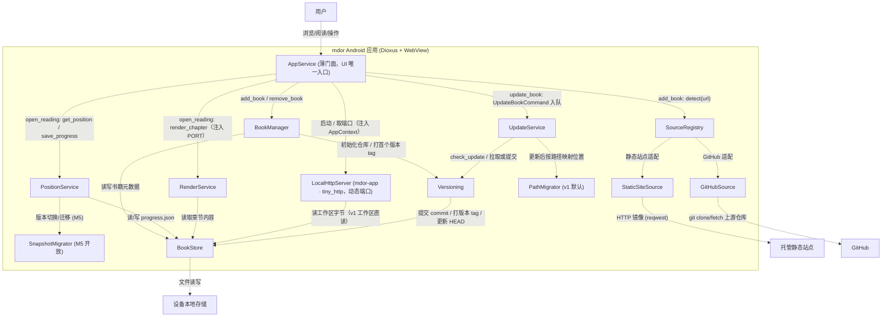
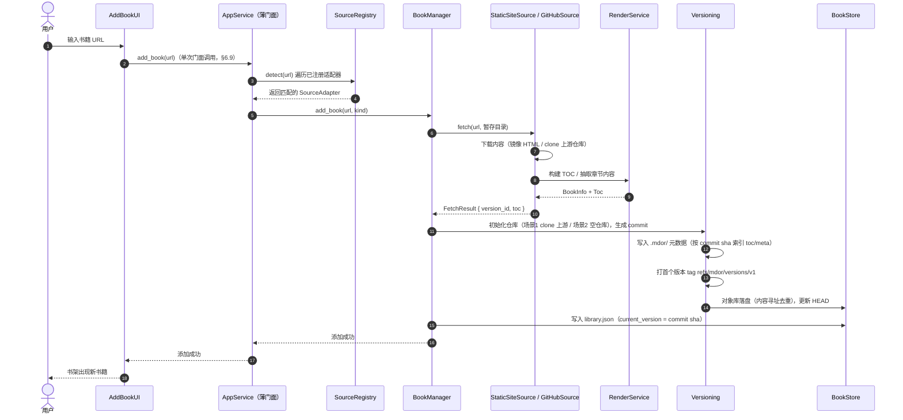
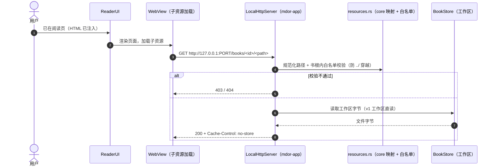
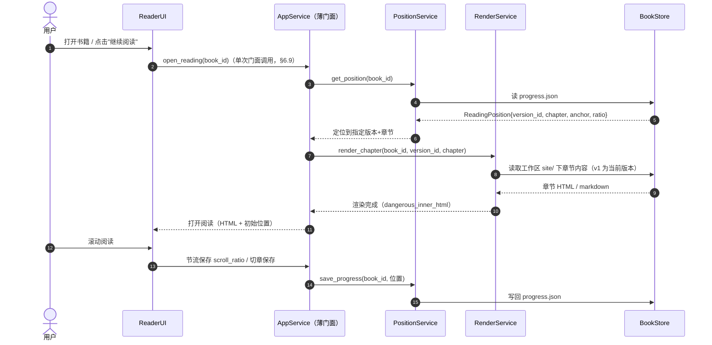
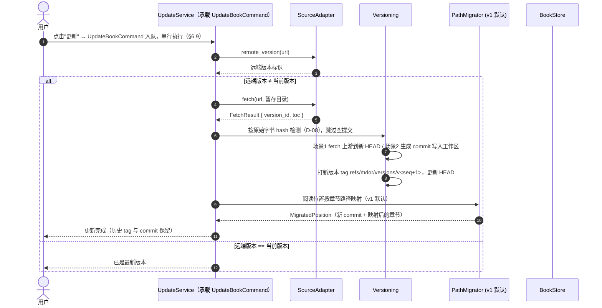
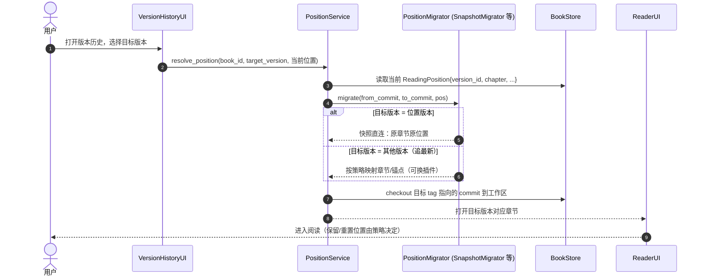

# mdor 项目架构文档

> 移动端 mdBook 离线阅读器 · Android · Rust + Dioxus
> 版本：0.1.0（规划稿）
> 文档索引见 [README.md](README.md)；关键决策见 [decisions.md](decisions.md)

---

## 1. 项目概述

### 1.1 目标

构建一个 **Android 移动端 mdBook 阅读器**，核心能力：

- 通过 **网址** 将远程文档下载到本地，离线阅读
- 支持两类输入来源：**GitHub 仓库（markdown 源文件）** 与 **托管静态站点（渲染好的 HTML）**
- 通过 **网址更新** 文档，并保留版本历史
- 记录 **阅读位置**（章节 + 滚动位置），支持书籍多版本阅读

### 1.2 技术栈

| 项 | 选择 | 说明 |
|---|---|---|
| 语言 | Rust (edition 2024) | 当前 1.97.1 |
| UI 框架 | Dioxus 0.7 | WebView 渲染，Android 一级支持；选型论证见 [D-15](decisions.md#d-15-ui-框架选型) |
| 构建 | dioxus-cli (`dx`) | `dx serve --platform android` |
| HTTP | reqwest (rustls) | Android 无 OpenSSL 依赖 |
| HTML 解析 | scraper | 抽取 mdBook `<main>` 内容 |
| Markdown | pulldown-cmark | 渲染 GitHub markdown 源 |
| 序列化 | serde / serde_json | 元数据与进度存储；`serde_json` 内置 128 层递归深度限制（防深嵌套栈溢出 DoS）、无 RUSTSEC、Rust 内存安全（见 [§6.7](#67-元数据写入可靠性json不用-sqlite) / [D-02](decisions.md#d-02-json-元数据而非-sqlite)） |
| 存储 | 本地文件系统 + gix | JSON 元数据 + 每书一个 git 仓库 |
| 版本/去重 | gix | commit 图 + 版本 tag 承载版本关系，对象库内容寻址去重 |

### 1.3 非目标

- 不内嵌 mdBook 构建流程（不在设备上跑 `mdbook build`）
- 不做在线搜索 / 云同步（首版）
- 不做 iOS（Windows 平台无法构建）

---

## 2. 设计原则

1. **插件化输入**：所有文档来源（GitHub、静态站点、未来更多）通过统一的 `SourceAdapter` trait 接入，核心逻辑不感知来源差异。
2. **核心与 UI 解耦**：`core/` 为纯 Rust、平台无关，可在桌面直接 `cargo test`；`ui/` 为 Dioxus 界面。
3. **离线优先**：所有内容必须先落盘才可阅读，网络仅用于获取与更新。
4. **版本感知**：书籍内容按 git commit 管理，每次抓取/更新打一个版本 tag（指向 commit sha），版本关系由 commit 图承载；阅读位置绑定具体版本，可回放、可迁移。
5. **位置迁移可插拔**：版本间的阅读位置跳转策略做成插件；v1 默认实现为"路径映射"（更新追最新），后续可扩展其他策略（含多版本快照直连）。
6. **编排收敛（薄门面 + 按需命令化）**：UI 层只依赖一个应用门面 `AppService`，单次用户操作 = 单次门面调用，业务编排不泄漏进 UI；长流程（网络 + 多步 + 可中断 + 需进度/串行）封装为命令对象，经命令队列串行执行。**不引入全局中介者**——架构为分层树状，`UpdateService`/`PositionService` 本就是各自流程的中介者，再加全局 hub 会退化为上帝对象（见 [§6.9](#69-服务编排薄门面-按需命令化) / [D-07](decisions.md#d-07-薄门面与命令化)）。

---

## 3. 总体架构

### 3.1 架构分层

```
┌──────────────────────────────────────────────────────────────┐
│                      UI 层 (Dioxus RSX)                      │
│   书架 LibraryUI · 添加 AddBookUI · 阅读 ReaderUI · 版本历史 │
├──────────────────────────────────────────────────────────────┤
│                      服务层 (Rust)                           │
│   AppService（薄门面，UI 唯一入口） · 命令队列串行执行       │
│   BookManager · SourceRegistry · UpdateService               │
│   PositionService · RenderService                            │
│   LocalHttpServer (mdor-app · tiny_http，动态端口，读工作区) │
├──────────────────────────────────────────────────────────────┤
│                      核心/插件层 (Rust)                      │
│   StaticSiteSource · GitHubSource      (输入适配插件)        │
│   PathMigrator (v1 默认) · SnapshotMigrator (+ 预留)         │
│   Versioning · BookStore               (核心能力)            │
├──────────────────────────────────────────────────────────────┤
│                      设备存储 (本地文件系统 + gix)           │
│   library.json · progress.json                               │
│   books/<id>/  (git 仓库：.git 对象库 + 工作区 + 版本 tag)   │
└──────────────────────────────────────────────────────────────┘
```
### 3.2 C4 组件图



> 该图由 LikeC4 建模生成，源文件见 [mdor.c4](mdor.c4)（再生成：`likec4 gen mermaid . -o <输出目录>`）。

### 3.3 UI 平台自适应设计（移动优先 + 桌面壳）

同一套 core 逻辑同时服务 Android（手机/平板）与 Windows 桌面；**自适应仅是 `mdor-app` UI 层的布局/交互差异，core 与业务逻辑零改动**（落地 §2 原则 2）。`mdor-app` 为 Dioxus WebView，视口宽度可直接读取（桌面为窗口宽度）。

- **移动优先（默认，≤600px）**：底部导航（书架/添加/设置）、全屏阅读、目录抽屉、手势操作（滑动返回、下拉刷新）；断点以视口宽度 600px 划分。
- **桌面壳（宽屏 ≥600px）**：左侧固定侧边栏（书架 + 目录树）、顶部工具栏、鼠标/键盘交互（快捷键、滚轮、右键菜单可选）；仅重建 UI 壳，`AppService` 句柄与阅读进度等状态不丢。
- **断点切换**：监听视口宽度变化（如窗口缩至手机宽度）即时切换导航壳，验证见 §10 M3。
- **输入适配**：添加书籍 URL——手机为文本输入 + 键盘；桌面支持快捷键聚焦与整段粘贴。URL 探测/校验仍在 core。
- **手势与系统能力（M6 真机）**：Android 返回键/安全区（WebView 内容避让状态栏与导航栏）、触摸滚动与 WebView 渲染性能，验证见 §10 M6。

---

## 4. 插件化输入架构

所有文档来源抽象为统一的 `SourceAdapter` trait，输入模块即为"插件"，通过 `SourceRegistry` 注册、按 URL 探测。

```rust
// core/source/mod.rs
#[derive(Clone, Copy, Debug, serde::Serialize, serde::Deserialize, PartialEq, Eq)]
pub enum SourceKind {
    StaticSite, // 托管静态站点：镜像 HTML
    GitHub,     // GitHub 仓库：拉取 markdown 源
}

#[async_trait]
pub trait SourceAdapter: Send + Sync {
    fn kind(&self) -> SourceKind;
    fn name(&self) -> &'static str;

    /// 探测：该适配器是否认识这个 URL
    fn detect(&self, url: &str) -> bool;

    /// 获取/刷新：从 URL 拉取内容写入 dest，返回书籍结构与版本标识
    async fn fetch(&self, url: &str, dest: &Path) -> Result<FetchResult>;

    /// 版本标识：返回当前远端版本字符串（GitHub: commit SHA；静态站: ETag/内容树 hash（git tree oid））
    async fn remote_version(&self, url: &str) -> Result<Option<String>>;
}

pub struct FetchResult {
    pub version_id: String,
    pub book: BookInfo,
    pub toc: Vec<TocEntry>,
}
```

### 4.1 内置适配器

| 适配器 | 输入 | 处理方式 |
|---|---|---|
| `StaticSiteSource` | `https://host/book/...` | 递归镜像同源页面/资源，保 mdBook 目录结构，抽取 `<main>`；抓取内容自建 git 链（场景 2） |
| `GitHubSource` | `https://github.com/user/repo[/tree/...]` | **git clone/fetch 上游仓库**（保留上游历史），解析 `src/SUMMARY.md` 建 TOC，工作区即上游文件，`pulldown-cmark` 渲染；拉取点打版本 tag（场景 1） |

### 4.2 添加书籍流程（序列图 SD-1）



---

## 5. 数据模型

```rust
/// 书架上的书籍元数据（library.json 中每条）
#[derive(Serialize, Deserialize, Clone)]
pub struct Book {
    pub id: String,              // book_id，由来源 URL 派生
    pub source_kind: SourceKind,
    pub url: String,             // 原始网址（用于更新）
    pub title: String,
    pub current_version: String, // 当前版本（HEAD commit sha）
    pub added_at: i64,
    pub updated_at: i64,
}

/// 一次获取的内容快照（书籍的一个版本；由 tag refs/mdor/versions/<seq> 标记）
pub struct VersionSnapshot {
    pub version_id: String,      // 版本 tag 指向的 commit sha
    pub workdir: PathBuf,        // 仓库工作区（场景1: 上游文件；场景2: books/<id>/site/）
    pub toc: Vec<TocEntry>,      // 章节树（存于 .mdor/versions/<sha>.json，未被 git 跟踪）
    pub meta: SnapshotMeta,      // 获取时间、来源版本标识、内容树 hash（git tree oid）
    // 版本标记 = 私有 tag（refs/mdor/versions/<seq>）；parent 由 commit 图派生，不单独存储
}

/// 阅读位置 —— 与具体版本绑定
#[derive(Serialize, Deserialize, Clone)]
pub struct ReadingPosition {
    pub book_id: String,
    pub version_id: String,      // 位置所属版本（commit sha；v1 更新时被 path 迁移改写）
    pub chapter_path: String,    // 章节路径（TOC 中的相对路径）
    pub heading_anchor: Option<String>, // 标题锚点（mdBook 输出自带）
    pub scroll_ratio: f32,       // 章节内滚动比例 0.0~1.0
    pub saved_at: i64,
}

/// 位置迁移结果
pub struct MigratedPosition {
    pub target_version: String,
    pub target_chapter: String,
    pub target_anchor: Option<String>,
    pub strategy: MigrateStrategy, // 见 §8
}
```

---

## 6. 核心模块

### 6.1 BookManager
书籍生命周期编排：`add_book`、`remove_book`、`update_book`。不感知来源差异，统一走 `SourceRegistry` + `Versioning`。

### 6.2 SourceRegistry
注册表 + 工厂：持有 `Vec<Box<dyn SourceAdapter>>`，`detect(url)` 依次询问。新增来源 = 新增一个实现 `SourceAdapter` 的插件模块并注册，核心与 UI 零改动。

### 6.3 UpdateService
更新编排：更新流程封装为 `UpdateBookCommand`（§6.9），经命令队列串行执行（见 §7.3 SD-3）。

### 6.4 PositionService
阅读位置读写（`progress.json`），以及调用 `PositionMigrator` 完成版本间位置迁移（见 §8）。

### 6.5 RenderService
统一渲染管线：
- `StaticSite` 路径：读取章节 HTML → `scraper` 抽取 `<main id="content">` → 重写资源链接为本地绝对 URL（`http://127.0.0.1:PORT/books/<id>/<path>`，不带版本号，两端统一走本地 http 服务，见 [diff.md §2.3](diff.md#23-逐维度对比) / [D-04](decisions.md#d-04-本地资源分发)）→ `dangerous_inner_html` 注入（[D-05](decisions.md#d-05-渲染形态)）
- `GitHub` 路径：读取 `.md` → `pulldown-cmark` → HTML → 同一注入管线
- [【当前】 内联书籍 CSS（include_bytes! 内嵌）](decisions.md#方案-1-includebytes-内嵌)：样式经 `include_bytes!` 编入发布二进制，渲染时随 `<style>` 内联注入，不经本地 http 服务器（改主题 = 重新发布二进制；主题热更新走 [【备选】 方案 2：首启复制落盘](decisions.md#方案-2-首启复制落盘)，见 [D-06](decisions.md#d-06-静态资源分流)），保证代码高亮等样式一致

**PORT 来源与本地服务器职责**（服务器进程归 `mdor-app`，详见 [§6.5.1](#651-本地子资源请求序列图-sd-5) / [§12.1](#121-关键设计决策)）：`LocalHttpServer` 用 `bind("127.0.0.1:0")` 动态端口，app 启动时起服并把 PORT 随 `AppService`/`AppContext` 注入；本渲染管线在内存中把 PORT 写入重写 URL。注入 HTML 后，WebView 向 `http://127.0.0.1:PORT/books/<id>/<path>` 请求子资源，由服务器经 core `resources.rs` 规范化/白名单校验后读工作区字节返回——两端统一，自定义 scheme `mdor-book://` 仅作备选（见 [D-04](decisions.md#d-04-本地资源分发)）。

#### 6.5.1 本地子资源请求（序列图 SD-5）

> 渲染注入完成后的回程建模：WebView 自主向本地服务器发起子资源请求（不经过 `AppService` 调用链）。



### 6.6 离线阅读 + 进度恢复（序列图 SD-2）



### 6.7 元数据写入可靠性（JSON，不用 SQLite）

几十本书量级的元数据总量 < 100KB，访问形态为按 `book_id` 的简单读写、单进程单写者（串行化即可），无关系查询需求——**JSON 文本足够，不引入 SQLite**（避免 C 依赖/Android 交叉编译复杂度与 schema 迁移，保持依赖纯 Rust）。可靠性由以下约定保证：

| 场景 | 风险 | 解法 |
|---|---|---|
| 写入一半被杀（滚动存进度） | 文件损坏 | **原子写**：写 `*.tmp` + 同目录 `rename` 覆盖（Android/Linux 上原子），要么旧文件要么新文件，无半写状态 |
| `add_book`/更新多步中断（建仓库 → 写 `.mdor/` → 写 `library.json`） | 半完成状态 | `library.json` **最后写** = 提交点：中断后书架无此书/仍为旧版本；孤儿 `books/<id>/` 目录启动时清理 |
| 断电/内核崩溃 | rename 未落盘 | fsync 兜底：**按文件类型分层**——`library.json` 做 fsync（低频高价值），`progress.json` 仅 rename（高频低价值，见 [diff.md §7.2](diff.md#72-mdor-的取舍已决策-2026-08-09按文件类型分层) / [D-03](decisions.md#d-03-原子写与-fsync-分层)） |

- 原子写封装为 `store` 内工具函数 `write_json_atomic(path, &data, durability)`，`durability` 为 `Fsync` / `RenameOnly`，调用方按文件类型传（`library.json` → Fsync；`progress.json`、versions 元数据 → RenameOnly），不按平台分支，core 平台无关
- 读取统一走 `read_json_capped(path, MAX_META_BYTES)`：**读文件前按字节数上限拦截**（默认 1MB，远超正常元数据量级），把"超大文档耗尽 CPU/内存"这类 DoS 彻底关死（纵深防御，见 [D-02](decisions.md#d-02-json-元数据而非-sqlite)）
- 此策略适用于 `library.json`、`progress.json`；`.mdor/versions/<sha>.json` 为只增写、失败可重写，同样走原子写

### 6.8 解析器安全对照（serde_json 选型依据）

选型时逐项对照了 Java/C 生态近期公开漏洞（Jackson-core 异步解析器数字长度绕过 / 嵌套深度限制绕过、Eclipse Parsson 无文档大小上限、Fastjson2 AutoType RCE、cJSON 多个内存安全漏洞），结论：**均为 Java/C 生态问题，`serde_json` 在 Rust 内存模型下结构性不适用**（`from_str` 内置 128 层递归限制、无多态反序列化、内存安全由语言保证）；唯一设计上同源的"无文档大小上限"以 `read_json_capped()` 1MB 读入 guard 补齐。完整对照表与结论见 [D-02 JSON 元数据而非 SQLite](decisions.md#d-02-json-元数据而非-sqlite)。

### 6.9 服务编排：薄门面 + 按需命令化

调用关系上做两件事，避免"UI 直接认识多个服务、一次操作多次跨层调用"（落地 [§2](#2-设计原则) 原则 2 / 原则 6；决策记录见 [D-07](decisions.md#d-07-薄门面与命令化)）：

**薄门面（Facade，v1 即生效）**：UI 层只依赖 `AppService` 一个入口，单次用户操作 = 单次门面调用，协调细节全部收敛在门面内：

- `add_book(url)`：把 SD-1 的 `detect(url)` + `add_book(url, kind)` 合并为一次调用（UI 不再触达 `SourceRegistry`）
- `open_reading(book_id)`：把 SD-2 的"读位置 + 渲染章节 + 保存进度"合并为一次调用（UI 不再触达 `PositionService`/`RenderService`）

效果：UI 依赖数从 O(服务数) 降到 O(1)；业务编排不泄漏进 Dioxus 屏幕，"`mdor-app` 只做『拿到 HTML 注入 + 交互』"（§12.1）由门面兜底。

**命令化（Command，按需引入）**：按流程特征区分两类，不全局套壳：

| 流程特征 | 处理方式 |
|---|---|
| 短、无网络、无并发、无进度需求 | 普通函数（删除书籍、progress.json 读写） |
| 长 + 网络 + 可中断 + 需进度/串行 | 命令对象（更新书籍，SD-3） |

命令把"一次更新"封装为数据对象 `UpdateBookCommand`，统一实现 `Command` trait、经命令队列串行执行：

- **串行化**：队列一次只执行一条，天然落实 §6.7"单进程单写者"
- **进度上报**：`progress()` 暴露当前阶段（检查/下载/提交/迁移），UI 订阅显示"正在更新…"
- **中断续做**：命令携带执行阶段，Android 切后台/被杀后重试可跳过已完成步骤（如工作区已写好则不再下载）；完整断点续传不在命令范围内
- **可测试**：命令边界单一（"完成一次更新"），注入假适配器即可单测（httpmock 说明见 [diff.md §8.2](diff.md#82-httpmock-是什么)，用法见 [§10](#10-里程碑) M2/M4 行）

```rust
// core/services/commands/mod.rs
pub trait Command {
    type Output;
    /// 执行一次完整流程；ctx 持有全部模块句柄
    async fn execute(&self, ctx: &AppContext) -> Result<Self::Output>;
    /// 当前阶段（检查/下载/提交/迁移），供 UI 订阅
    fn progress(&self) -> Option<Progress> { None }
}

// 命令队列：一次只执行一条（串行化 = §6.7 单写者）
while let Some(cmd) = queue.recv().await {
    cmd.execute(&ctx).await?;
}
```

**v1 边界**：仅"更新书籍"（SD-3）命令化；"添加书籍"（SD-1）先拆命名函数（`check_latest` / `fetch_to_temp` / `commit_and_tag` / `migrate_and_save`），出现并发/进度需求再升级为命令。

**为什么不用全局中介者**：架构为分层树状（UI→服务→核心叶子，服务间几乎无互调），`UpdateService`/`PositionService` 本就是各自流程的中介者；再引入全局 hub 会令所有模块反向依赖一个中央对象，流程变隐式、难以测试与定位——净负收益，完整论证见 [D-07](decisions.md#d-07-薄门面与命令化)。

---

## 7. 版本控制设计

### 7.1 版本标识

两场景统一：**`version_id` = tag 指向的 commit sha**；用户可见的"版本" = 私有命名空间 tag `refs/mdor/versions/<seq>`。

| 来源 | commit 来源 | 说明 |
|---|---|---|
| GitHub（场景 1） | 上游仓库 commit | clone/fetch 上游历史，拉取点在最新 HEAD 打版本 tag，不向上游写任何内容 |
| 静态站点（场景 2） | 自建 commit | 每次抓取 = 一个 commit（parent=HEAD），随即打版本 tag |

### 7.2 快照模型（git 基座 + tag 统一版本）

- 每本书是一个由 gix 管理的 git 仓库：`books/<id>/`（对象库 `.git/` + 工作区）
  - **场景 1**：仓库 = 上游仓库克隆，历史原样保留（`git log`/`git diff` 直接可用），我们只加 tag、不 commit
  - **场景 2**：仓库 = 自建链，每次抓取一个 commit
- **用户版本 = tag**（`refs/mdor/versions/<seq>`，序号单调递增，避免与上游自身 tag 冲突），`version_id` = tag 指向的 commit sha
- 每次内容有变化的抓取/更新：场景 1 打新 tag、场景 2 生成 commit 并打新 tag；按 [D-08](decisions.md#d-08-变更检测) 原始字节 hash 检测，未变化则跳过空提交
- 对象库天然**内容寻址去重**：跨版本未变的文件只存一份（blob/tree 复用），无需额外去重机制
- `HEAD` 即当前版本，`current` 语义由 git ref 承载；版本列表 = 列 `refs/mdor/versions/*`
- 历史版本读取 = **按需 checkout 目标 commit 到工作区**（单一工作区、原地覆盖，无空间累加）
- 书籍元数据（`.mdor/`：toc/meta，按 commit sha 索引）位于仓库根下但**未被 git 跟踪**，两场景都不污染历史

### 7.3 更新流程（序列图 SD-3）



### 7.4 存储基座：为何 v1 起就用 gix

**结论：v1 起即以 gix（纯 Rust 的 git 实现）作为存储基座，每书一个 git 仓库，并以私有 tag 记录版本。** 版本历史 UI、多版本阅读、数据同步都不是 v1 功能，但存储基座一旦选定就应指向长期正确的那个——版本 tag 随每次抓取/更新**自然积累**，将来只需开放功能，而不用回头改造存储层。

**为什么是 git/gix 而不是"目录快照 + 手写版本链"**：commit 承载内容快照、commit 图承载历史关系、**tag 承载"版本"语义**、ref（HEAD）= 当前指针、对象库内容寻址 = 去重与校验，历史读取 = 按需 checkout 单一工作区、未来数据同步直接复用 git 协议——版本管理需要的每一件事都被 git 封装好了，自建等于重写一个简化且不完整的 git。完整论证（含被否定的替代方案：目录快照 + COW、git2/libgit2、blob 直接读）见 [D-01 gix 存储基座](decisions.md#d-01-gix-存储基座)。

**诚实成本（gix 封装掉了解析，剩下的工程成本）：**

| 成本项 | 说明 | 应对 |
|---|---|---|
| 依赖体积/内存 | gix 依赖树大，Android 上编译时间、APK 体积、内存上升 | 按需裁剪 feature；每书独立小仓库，控制单仓对象库规模 |
| 写路径 | 由"复制目录"变为"一次 commit"（gix 封装，无解析负担） | 场景1 只 fetch+打 tag、不 commit；场景2 直接使用 `gix` 高层 API（`commit` / tree / blob 读取） |
| 读历史版本 | checkout 目标 commit 到工作区；从对象库直接读 blob 为非必要优化 | 版本功能开放时按切换频率实测二选一 |
| GC / 清理 | 初期"删除版本" = 仅删 tag，不清理 git 历史；后续真回收磁盘需 shallow 截断 + gc | 初期两场景一致（只删 tag）；shallow 回收延后，两场景统一作为用户设置项 |

> 版本 tag 机制自 v1 生效（每次抓取/更新都打 tag，能力自然积累）；版本 UI / 多版本阅读（方案 D）/ 数据同步为后续里程碑开放的功能（见 [§8](#8-阅读位置在版本变动后的处理方案)、[§10](#10-里程碑)），开放时无需改造存储层，只需新增读取与展示。

---

## 8. 阅读位置在版本变动后的处理方案

### 8.1 设计决策

#### v1 行为：更新追最新（path 策略）
> [!IMPORTANT] 【当前】 v1 行为：更新追最新，path 策略
> 
> v1 不开放版本历史 UI。更新后阅读位置**按章节路径映射**到新版本（`chapter_path` 不变则直连，章节消失则 TOC 顺序回退相邻章节）；位置在更新时即迁移，不存在"读旧版"路径。

#### 方案 D：版本快照绑定
> [!NOTE] 【备选】 方案 D：版本快照绑定
> 触发：M5 版本功能开放
> 
> 阅读位置与具体 commit 强绑定：
> 
> - 记录时绑定 `version_id`（commit sha，该记录的位置必然可回放）
> - 更新后，位置仍指向旧版本 commit；用户从书架打开时，**默认继续读旧版本对应位置**，进度零丢失
> - 支持同一文档**多版本并行阅读**（版本历史界面选择任意版本）
> - 版本切换 = 按需 checkout 目标 tag 指向的 commit 到工作区；版本列表 = 列 `refs/mdor/versions/*`；清理策略（保留最近 N 版）在版本功能开放时实现

#### AnchorMigrator：标题锚点映射
> [!NOTE] 【备选】 AnchorMigrator：标题锚点映射
> 触发：需标题锚点级跳转（章节内多标题）
> 
> 增加标题锚点映射，锚点消失回退章节开头，标题改动用模糊匹配。

#### FingerprintMigrator：文本指纹定位
> [!NOTE] 【备选】 FingerprintMigrator：文本指纹定位
> 触发：需正文模糊定位（标题缺失/章节合并）
> 
> 记录阅读位置附近文本指纹，新版本全文检索命中后精确定位。

### 8.2 插件化迁移架构

实际"跳转"行为做成插件，未来可让用户选择不同策略。当前内置 `path`（v1 默认），其余后续逐个加入。

```rust
// core/migration/mod.rs
#[async_trait]
pub trait PositionMigrator: Send + Sync {
    fn id(&self) -> &'static str;
    fn name(&self) -> &'static str;
    /// 将旧版本位置迁移到目标版本（可能返回"保持旧版本"）
    async fn migrate(
        &self,
        from: &VersionSnapshot,
        to: &VersionSnapshot,
        pos: &ReadingPosition,
    ) -> Result<MigratedPosition>;
}
```

### 8.3 插件清单

| 插件 id | 名称 | 状态 | 行为 |
|---|---|---|---|
| `path` | PathMigrator | [【当前】 PathMigrator（v1 默认）](#v1-行为更新追最新path-策略) | 按 `chapter_path` 直接映射到新版本，路径消失则 TOC 顺序回退相邻章节 |
| `snapshot` | SnapshotMigrator | [【备选】 SnapshotMigrator（版本快照绑定）](#方案-d版本快照绑定) | 位置绑定旧版 commit，旧版本仍在 → 迁移结果即"读旧版原位置"；若用户选择追最新，则按 TOC 同名路径映射 |
| `anchor` | AnchorMigrator | [【备选】 AnchorMigrator（标题锚点映射）](#anchormigrator标题锚点映射) | 增加标题锚点映射，锚点消失回退章节开头，标题改动用模糊匹配 |
| `fingerprint` | FingerprintMigrator | [【备选】 FingerprintMigrator（文本指纹定位）](#fingerprintmigrator文本指纹定位) | 记录阅读位置附近文本指纹，新版本全文检索命中后精确定位 |

> v1 更新默认用 `path` 追最新；方案 D（多版本阅读 + 快照直连，M5）保证"永不丢位置"；其余插件是"用户主动追最新版"时的可选策略，将来通过设置界面选择。

### 8.4 版本切换 / 位置迁移（序列图 SD-4，M5 开放）



---

## 9. 存储布局

```
<数据根>/                        # 平台相关，仅此层不同（见下方注记）
└── data/
    └── bookstore/               # BookStore::new(base_dir) 注入点；其他数据类型可平级加目录
        ├── library.json         # 书架元数据（Book 列表 + current_version = HEAD commit sha）
        ├── progress.json        # 阅读位置（ReadingPosition 按 book_id 索引）
        └── books/
            └── <book_id>/       # gix 管理的 git 仓库（场景1: 上游克隆；场景2: 自建链）
                ├── .git/        # 对象库 + refs（含版本 tag refs/mdor/versions/<seq>，内容寻址去重）
                ├── src/, book.toml ...  # 工作区（场景1: 上游 mdBook 源文件；场景2: 镜像内容于 site/）
                ├── site/        # 工作区（场景2: 当前版本镜像内容，webview 经本地 http 服务读取）
                └── .mdor/       # 书籍元数据（仓库根下但未被 git 跟踪）
                    └── versions/
                        └── <commit sha>.json  # 每版本 toc/meta（按 commit sha 索引）
```

- 用户版本 = 私有 tag `refs/mdor/versions/<seq>`；版本列表 = 列 tag；`current` 语义即 git `HEAD`
- `.mdor/` 未被 git 跟踪：toc/meta 按 commit sha 索引，两场景都不污染仓库历史（场景1 尤其关键——克隆的上游历史不被任何附加 commit 改动）
- 历史版本读取 = 按需 checkout 目标 tag 指向的 commit 到工作区（单一工作区，无空间累加）
- 应用级元数据（`library.json`/`progress.json`）位于仓库之外，避免与版本内容混存

> `<数据根>` 平台相关：Android 通过 `android_activity`/JNI 取 `getFilesDir()`（应用私有目录）；Windows 用 `std::env::current_exe()` 取 **exe 同目录**（便携式：不存在则 `create_dir_all`，**目录不可写直接报错，不回退**到系统用户目录）。core 只见 `bookstore/` 这一层，数据根解析在 `mdor-app` 启动时 cfg 分支完成（决策记录见 [D-13 数据目录注入](decisions.md#d-13-数据目录注入)）。

---

## 10. 里程碑

| 阶段 | 内容 | 验证方式 |
|---|---|---|
| **M0** | 桌面开发环境搭建（VS/MSVC、rust-toolchain、dioxus-cli；android targets/JDK/SDK/NDK 留待 M6） | `dx serve --platform desktop` 跑通 |
| **M1** | workspace + `mdor-core` 骨架（model / store / source trait / versioning / migration trait + 单测）+ gix 存储基座 + 服务门面 `AppService` + 命令骨架（`Command` trait + 队列 + `UpdateBookCommand` 占位）+ `mdor-app` 书架骨架（中文 UI）+ 轻量 `ci.yml`（core-quality：fmt/clippy/test/audit） | `cargo test -p mdor-core` / `cargo run` / CI 全绿 |
| **M2** | `StaticSiteSource` + 递归镜像下载（自建链 + 版本 tag；`fixtures/mdbook-static/` 集成测试 + httpmock） | 用真实 mdBook 站点离线镜像 |
| **M3** | 阅读器：内容抽取、资源协议、目录抽屉、滚动进度 | 桌面全流程 + 自适应布局验证（窗口缩至手机宽度） |
| **M4** | `GitHubSource`：git clone/fetch 上游仓库（保留历史）+ SUMMARY 解析 + markdown 渲染（`fixtures/github-sample/` + httpmock） | 真实仓库测试 |
| **M5** | 版本功能开放：版本历史 UI + 按需 checkout 多版本阅读 + SnapshotMigrator（方案 D）+ 清理策略（初期删版本 tag；后续 shallow 截断 + gc 为可选设置项，两场景统一） | 修改源站后更新，验证旧版本位置可回放 |
| **M6** | Android 打包（APK）、权限/存储目录/cleartext 配置 | 模拟器/真机验证 + 真机触控交互验证（滑动/返回/安全区/WebView/性能） |
| **M7** | CI 与发布（GitHub Actions）：设计补充 + 落地 `ci.yml`（core-quality / windows-desktop-check / android-check）+ `release.yml`（tag 触发，签名 APK + Windows 桌面 exe）+ CI 与本地工具链解耦说明 | 打一个 tag 触发 CI 产出双平台 artifact；PR 自动跑质量与双平台编译检查 |

### 10.1 M6 真机验证清单

> 维持 Dioxus WebView 方案的前提下，把剩余 WebView 相关风险归拢为 M6 真机验证与打包配置项（2026-08-09 决策，自原 `diff.md` §9 迁入）。多数已在前文给出方案，此处为实施清单。

#### 宿主与内核

| # | 风险 | 依据 | 验证/落地 |
|---|---|---|---|
| A1 | 真机 API < 30 崩溃 `NoSuchMethodError getCurrentWindowMetrics` | [env.md §6](env.md#6-故障排查速查) | `Dioxus.toml` 设 `min_sdk_version = 30` |
| A2 | System WebView 版本碎片化 → 渲染差异 | [diff.md §2.3](diff.md#23-逐维度对比)「内核版本与渲染一致性」 | 内联书籍 CSS 对冲；真机对比不同 WebView 版本的书页排版 |
| A3 | 桌面 WebView2 与 Android System WebView 渲染不一致 | 同上 | 同一书页双端截图对比（字体/图片/代码高亮） |

#### 本地资源通道（tiny_http）

| # | 风险 | 依据 | 验证/落地 |
|---|---|---|---|
| B1 | 服务器跑主线程卡 UI | [diff.md §2.3](diff.md#23-逐维度对比)「本地 http 方案的 Android 限制与对策」 | `tiny_http` 独立线程池，主线程不阻塞 |
| B2 | 端口冲突 | 同上 | `bind("127.0.0.1:0")` 动态端口，由 app 层 `LocalHttpServer` 持有并注入 `AppService`，先于渲染确定并写入重写 URL |
| B3 | cleartext 明文被 Android 9+ 拦截 | [diff.md §5.1](diff.md#51-背景知识http-的明文与-app-网络策略) | network security config 白名单**仅放行 127.0.0.1**，不全局放开 |
| B4 | INTERNET 权限缺失 bind 失败 | [diff.md §2.3](diff.md#23-逐维度对比) | manifest 声明（reqwest 本就需要） |
| B5 | 目录穿越 `../` 读任意文件 | [diff.md §2.3](diff.md#23-逐维度对比)「重写规则与一一对应」 | URL 规范化 + 书根内白名单校验 |
| B6 | 切版本后同路径资源吃旧缓存 | [D-04](decisions.md#d-04-本地资源分发)「URL 不带版本号」 | 服务器统一 `Cache-Control: no-store` |
| B7 | 阅读页样式分发方式（[【当前】 方案 1：include_bytes! 内嵌](decisions.md#方案-1-includebytes-内嵌) / [【备选】 方案 2：首启复制落盘](decisions.md#方案-2-首启复制落盘)） | [D-06](decisions.md#d-06-静态资源分流) | **已决策（2026-08-13）**：`include_bytes!` 内嵌 + 渲染内联；将来主题热更新再实现首启复制（需 app 层兼容层抹平平台差异，清单后续整理） |
| B8 | 进程被杀，服务器随进程消失 | [diff.md §2.3](diff.md#23-逐维度对比) | 阅读页前台期间依赖存在；不常驻 Service |

#### 线程纪律

| # | 风险 | 依据 | 验证/落地 |
|---|---|---|---|
| C1 | tokio 后台任务直接碰 UI 崩溃 | [diff.md §2.3](diff.md#23-逐维度对比)「线程模型」 | 所有 UI 更新切回主线程；创建 WebView 必须在主线程 |
| C2 | Android 生命周期（被杀/恢复）与命令中断续做 | [§6.9](#69-服务编排薄门面-按需命令化) | `UpdateBookCommand` 携带阶段，重试跳过已完成步骤 |

#### 真机交互

| # | 风险 | 依据 | 验证/落地 |
|---|---|---|---|
| D1 | 触摸滚动与渲染性能 | [§10](#10-里程碑) M6 | 真机长文档滚动帧率/流畅度实测 |
| D2 | Android 返回键 / 手势返回 | [§3.3](#33-ui-平台自适应设计移动优先-桌面壳) | 返回键优先级：阅读页 → 目录 → 书架 |
| D3 | 安全区（状态栏/导航栏避让） | [§3.3](#33-ui-平台自适应设计移动优先-桌面壳) | WebView 内容避让 + 底部导航适配 |
| D4 | 切版本与渲染协调 | [§11](#11-风险与待定项) | 先加载章节到内存再 checkout，或切换后 reload |

#### 渲染形态

| # | 风险 | 依据 | 验证/落地 |
|---|---|---|---|
| E1 | `dangerous_inner_html` 不执行 `<script>` | [§11](#11-风险与待定项) | 由 Dioxus 自绘 TOC/导航替代（预期行为），验证书页无功能缺失 |
| E2 | 本地 http 与 App 页面跨源 | [diff.md §2.3](diff.md#23-逐维度对比)「本地 http 方案的 Android 限制与对策」 | 仅子资源加载，无 iframe/读写，无需 CORS 头 |
| E3 | DevTools 调试 | [diff.md §2.3](diff.md#23-逐维度对比)「开发调试体验」 | `chrome://inspect` + adb 远程调试 |

#### 双端对齐

| # | 风险 | 依据 | 验证/落地 |
|---|---|---|---|
| F1 | 桌面与 Android 行为一致性 | [diff.md §8.3](diff.md#83-对-mdor-的落地影响) | core 桌面 `cargo test` 已覆盖；app 层差异 M6 真机回归 |

> 状态划分：**A1 / B3 / B4 为 M6 打包配置项**；其余为 M6 真机验证项。

---

## 11. 风险与待定项

| 风险/待定 | 影响 | 应对 |
|---|---|---|
| 本地资源分发通道（原"wry 自定义协议在 Android 的兼容性"） | 阅读页图片/资源加载 | [【当前】 统一本地 tiny_http 服务器](decisions.md#统一本地-http-服务器分发)（已决策，[D-04](decisions.md#d-04-本地资源分发)）：两端统一本地 `tiny_http` 服务器（进程归 app 层）+ `http://127.0.0.1:PORT` 绝对 URL；`mdor-book://` 自定义 scheme [【备选】 mdor-book:// 自定义 scheme](decisions.md#mdor-book-自定义-scheme) 降级为后续可选，见 [diff.md §2.3](diff.md#23-逐维度对比) |
| Android 数据目录获取 | 存储路径 | JNI `getFilesDir()`；桌面走 exe 同目录 `data/`（便携式） |
| mdBook 高级扩展（`{{#playground}}`、LaTeX、mermaid） | GitHub 源渲染保真度 | 首版仅支持 `{{#include}}`，其余列出 |
| `dangerous_inner_html` 不执行 `<script>` | 搜索/导航原生 JS 失效 | 由 Dioxus 自绘 TOC/导航替代（预期行为） |
| gix 依赖体积/内存（Android） | APK 大小、启动内存 | 按需裁剪 gix feature；每书独立小仓库控制对象库规模 |
| checkout 切版本与 webview 渲染协调 | 切版本时工作区文件被替换 | 先加载章节到内存再切换，或切换后 reload |
| gix 在 Android 的可用性 | 存储基座能否正常跑 | M1 桌面验证 + M6 真机验证 |
| 版本历史的存储占用 | 设备空间 | 清理策略（初期只删版本 tag、后续 shallow 截断 + gc 用户设置）见 [§7.4](#74-存储基座为何-v1-起就用-gix) 成本表「GC / 清理」；「保留最近 N 版」M5 敲定 |
| 上游仓库体积 / Git LFS | 场景1 磁盘占用与图片渲染 | 依赖 gix 对象去重；LFS 仓库 clone 仅得指针文件，首版提示暂不支持 |
| 静态站点镜像边界 | 防止越界爬取 | 限同源 + 深度/大小上限 |
| 大小写碰撞物理冲突（`Foo.md` vs `foo.md`） | Windows NTFS 只能落一个文件 | tree 级检测（平台无关）；同 blob 归一；异 blob 两选项（双渲染+标注 默认 / 报错）；Windows 接受单渲染+标注退化；跨平台真双渲染绑定可选"blob 直接读"能力（[D-10](decisions.md#d-10-资源读取通道)，默认不引入） |
| 兼容层平台差异清单（方案 2/主题热更新前置，[D-06](decisions.md#d-06-静态资源分流)） | 样式资源提供者的平台差异（JNI AssetManager / `getFilesDir()` 注入） | 方案 2 落地时先整理清单再设计接口，兼容层收敛差异、core 保持平台无关 |
| 孤儿 `books/<id>/` 目录清理（提交点设计配套） | 磁盘空间、启动扫描耗时 | "启动时清理"已定（[§6.7](#67-元数据写入可靠性json不用-sqlite)）；判定孤儿标准（以 `library.json` 为准）、清理时机/保留策略未定——M1 实现时敲定 |

---

## 12. 项目文件结构

采用 **Cargo workspace** 承载 core / ui 分层（对应 §2 设计原则 2）。`mdor-core` 为纯 Rust、平台无关库，桌面可直接 `cargo test`；`mdor-app` 为 Dioxus UI 二进制（`dx` 构建目标）。输入适配器与位置迁移插件均为 core 内模块、编译期注册（对应 §4 / §8）。

```
mdor/
├── Cargo.toml                 # [workspace] members + [workspace.dependencies] 统一锁定依赖版本
├── rust-toolchain.toml        # 钉版版本见 env.md §1（M0 不装 android targets；M6 补回 arm64-v8a / x86_64，见 env.md §7）
├── .gitignore                 # /target、mobile/android 构建产物、fixtures 下载缓存、dev/ 工具树、config.local.toml
├── .cargo/config.toml         # 提交：Android 工具链 [env]（相对路径、无 force）+ include 本地覆盖（M6 生效，见 env.md §2.6）
├── README.md
├── doc/                       # 本架构文档、mdor.c4 等
├── dev/                       # M6：便携工具链树（gitignored，仅 dev-env.ps1 跟踪；见 env.md §2.6）
│
├── crates/
│   ├── mdor-core/             # 纯 Rust 库，平台无关，桌面可直接 cargo test
│   │   ├── Cargo.toml
│   │   └── src/
│   │       ├── lib.rs
│   │       ├── error.rs               # 统一错误类型
│   │       ├── model/                 # §5 数据模型（纯数据，无 IO）
│   │       │   ├── mod.rs             #   模块聚合
│   │       │   ├── book.rs            #   Book
│   │       │   ├── snapshot.rs        #   VersionSnapshot / SnapshotMeta
│   │       │   ├── toc.rs             #   TocEntry
│   │       │   └── position.rs        #   ReadingPosition / MigratedPosition
│   │       ├── store/                 # §6.6/6.7 BookStore：文件系统持久化（§9 存储布局，JSON 原子写）
│   │       │   ├── mod.rs             #   BookStore 聚合入口，base_dir 注入
│   │       │   ├── util.rs            #   write_json_atomic + read_json_capped（§6.7 原子写，durability 按文件类型，1MB 读入 guard）
│   │       │   ├── library.rs         #   library.json 读写（原子写，提交点）
│   │       │   ├── progress.rs        #   progress.json 读写（原子写）
│   │       │   └── snapshot.rs        #   git 仓库快照：clone/fetch 上游（场景1）/ 自建链 commit（场景2）、版本 tag 管理、工作区 checkout（gix）
│   │       ├── source/                # §4 输入插件（编译期注册）
│   │       │   ├── mod.rs             #   SourceKind / SourceAdapter trait / FetchResult
│   │       │   ├── registry.rs        #   SourceRegistry（detect 遍历）
│   │       │   ├── static_site.rs     #   StaticSiteSource：递归镜像 + <main> 抽取（自建链）
│   │       │   └── github.rs          #   GitHubSource：git clone/fetch 上游 + SUMMARY 解析 + md 渲染
│   │       ├── versioning.rs          # §7 commit/版本 tag 生成、HEAD/ref 维护、对象去重（gix 对象库）
│   │       ├── migration/             # §8 位置迁移插件
│   │       │   ├── mod.rs             #   PositionMigrator trait
│   │       │   ├── path.rs            #   PathMigrator（v1 更新默认，按章节路径映射）
│   │       │   └── snapshot.rs        #   SnapshotMigrator（方案 D，M5 开放）
│   │       ├── render/                # §6.5 RenderService 统一渲染管线
│   │       │   ├── mod.rs             #   render_chapter 入口
│   │       │   ├── html_extract.rs    #   scraper 抽 <main> + 资源链接重写
│   │       │   ├── markdown.rs        #   pulldown-cmark → HTML
│   │       │   └── resources.rs       #   双向 URL↔规范化路径映射 + 书根内白名单（纯函数、无 socket；渲染重写与 app 侧 LocalHttpServer 共用，见 diff.md §2.3）
│   │       └── services/              # §6 服务编排层（§6.9 薄门面 + 命令化）
│   │           ├── app_service.rs     #   AppService：UI 唯一门面（add_book / open_reading 等聚合入口）
│   │           ├── book_manager.rs    #   add/remove/update 编排
│   │           ├── update_service.rs  #   更新编排（承载 UpdateBookCommand，§7.3 SD-3）
│   │           ├── position_service.rs#   进度读写 + 迁移调用（§8.4 SD-4）
│   │           └── commands/          #   §6.9 命令对象（队列串行执行 + 进度上报）
│   │               ├── mod.rs         #   Command trait + 命令队列
│   │               └── update_book.rs #   UpdateBookCommand（SD-3 流程命令化）
│   │
│   └── mdor-app/              # Dioxus UI 二进制（dx 构建目标）
│       ├── Cargo.toml
│       ├── Dioxus.toml        # [application] [android] [asset] 配置，dx serve --project 指向此目录
│       ├── assets/            # CSS / 字体 / 图标（dx 打包资源）
│       ├── mobile/            # dx 生成的 Android 原生工程（构建产物，勿手改）
│       └── src/
│           ├── main.rs        # dioxus::launch 入口 + Android getFilesDir()/桌面 exe 同目录路径解析
│           ├── local_http.rs  #   LocalHttpServer：tiny_http 起停/动态端口/no-store 头/白名单校验（经 core resources.rs）
│           ├── app.rs         # Router + 主题
│           ├── state.rs       # GlobalSignal：AppService 句柄、当前书籍/版本
│           ├── screens/       # §3.1 UI 四屏
│           │   ├── library.rs #   书架
│           │   ├── add_book.rs#   添加书籍
│           │   ├── reader.rs  #   阅读（dangerous_inner_html + 滚动节流存进度）
│           │   └── versions.rs#   版本历史
│           └── components/    # 抽屉、列表、按钮等复用组件
│
└── fixtures/                  # 测试样例（core 集成测试用，不随包发布）
    ├── mdbook-static/         # 预构建的静态 mdBook 站点（M2 镜像测试）
    └── github-sample/         # 带 SUMMARY.md 的 markdown 仓库样例（M4 解析测试）
```

### 12.1 关键设计决策

- **核心与 UI 解耦验证**：全部业务逻辑（含渲染管线）在 core，`mdor-app` 只做「拿到 HTML 注入 + 交互」；验证方式即 `cargo test -p mdor-core` 桌面直跑。
- **异步运行时**：core 用 tokio；reqwest 配 rustls（Android 无 OpenSSL）。
- **资源分发归属**：本地 `tiny_http` 服务器进程归 `mdor-app`（`local_http.rs`：起停 + 动态端口 + `Cache-Control: no-store` + 白名单校验）；`render/resources.rs` 是 core 纯映射（URL↔规范化路径，重写与服务两端共用同一逻辑、无 socket）；v1 服务器只服务书内容（工作区直读），阅读页样式内联不经服务器（[D-04](decisions.md#d-04-本地资源分发) / [D-06](decisions.md#d-06-静态资源分流)）。
- **依赖版本统一**：reqwest / scraper / pulldown-cmark / serde / gix 等在根 `[workspace.dependencies]` 钉一次。

**决策状态**（单一事实源 = [decisions.md 决策总览](decisions.md#决策总览)，含状态与规范位置反向链接；背景 / 依据 / 影响见各 D-xx，本表不重复维护）

> 其中"blob 直接读"的接口可行性（gix `find_blob` / `tree.traverse()`）、收益与代价细节见 [D-10](decisions.md#d-10-资源读取通道)。

### 12.2 里程碑映射

> 各里程碑的交付要点与验证方式已并入 [§10](#10-里程碑) 里程碑表；CI/发布落地见 [§12.3](#123-ci-与发布github-actions)。

### 12.3 CI 与发布（GitHub Actions）

仓库公开，Actions 分钟全免（Linux/Windows 均计 0）。**CI 与本地工具链解耦**：本地保持 MSVC + 计划内依赖（[env.md §1](env.md#1-环境总览与版本矩阵)），CI 用原生 runner 默认工具链；**不引入 Zig**（无引入 Zig 的 C 交叉编译需求：Android 由 NDK clang、Windows 由 MSVC 覆盖）。

> 版本（rust / NDK / JDK / dioxus-cli）单一事实源 = [env.md §1](env.md#1-环境总览与版本矩阵)，下表以「钉版」指代、不重复列具体号。

**`ci.yml`（PR / push 校验，M1 起先挂 core-quality，M7 补全）：**

| Job | 环境 | 内容 |
|---|---|---|
| `core-quality` | `ubuntu-latest` + rust 钉版 | `cargo fmt --check` → `clippy -D warnings` → `cargo test -p mdor-core`（含 httpmock 集成）→ `cargo audit` |
| `windows-desktop-check` | `windows-latest`（原生 MSVC，host 目标） | `cargo check -p mdor-app`，提前抓 Windows 侧编译回归 |
| `android-check` | `ubuntu-latest` + NDK 钉版 + rust android targets | `cargo check --target aarch64-linux-android -p mdor-app` + `dx doctor` 冒烟 |

**`release.yml`（tag `v0.1.0` 触发，双 job 并行）：**

- **android**（`ubuntu-latest`）：JDK（钉版，`setup-java`）→ Android SDK + NDK 钉版（`android-actions/setup-android`）→ rust 钉版 + android targets → 钉版 dioxus-cli → `dx build --platform android --release --target aarch64-linux-android`（**release 只编 arm64-v8a 单 ABI**）→ keystore（GitHub Secrets）签名 → APK 上传 + Release asset
- **windows-desktop**（`windows-latest`，原生 MSVC）：rust 钉版 → 钉版 dioxus-cli → `dx build --platform desktop --release` → exe 打 zip 上传 + Release asset

**要点：**

- rust-toolchain.toml 现为 M0 版（无 targets）；CI 用 `dtolnay/rust-toolchain` 显式装 `aarch64-linux-android` / `x86_64-linux-android` 双 target（对齐 [env.md §7](env.md#7-m0-到-m6-过渡清单补回-android-侧) toml 补回），release 构建只用 arm64。
- CI 的 MSVC **不钉 14.50**：windows-latest 预装 VS Build Tools，Rust `find-msvc-tools` 自动识别即可；14.50 钉版仅服务本地可复现（[env.md §1](env.md#1-环境总览与版本矩阵)）。
- 桌面产物仍需目标机 Win11 预装 WebView2；首版出 exe zip，`dx bundle` 安装包为可选增强。
- 签名密钥与密码只存 GitHub Secrets，不入仓库。
- 缓存：`Swatinem/rust-cache` + 缓存 dx 二进制（dx 经 `cargo install` 安装，命令见 [env.md §2.3](env.md#23-dioxus-clidx)，是全流程最耗时步骤）；`concurrency: cancel-in-progress` 取消重复 push。

---

*本文件为架构规划稿，随实现推进持续更新。*

