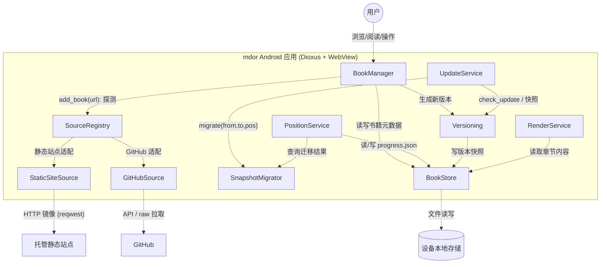
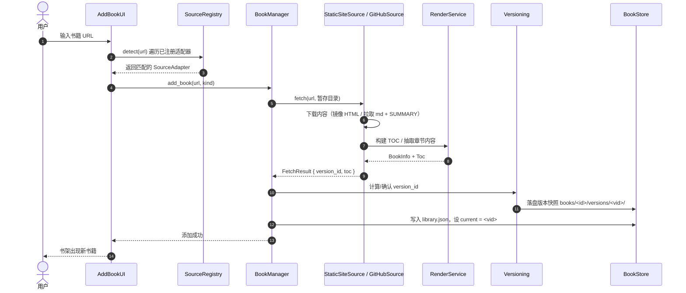
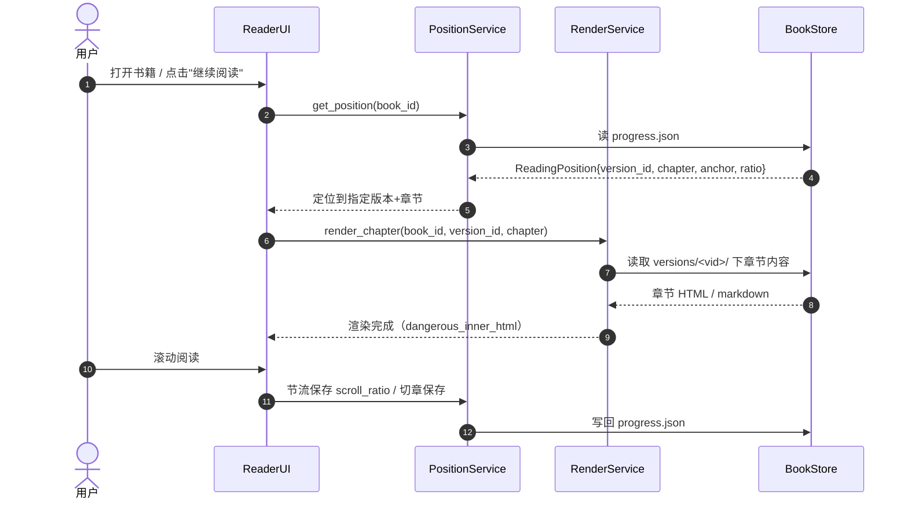
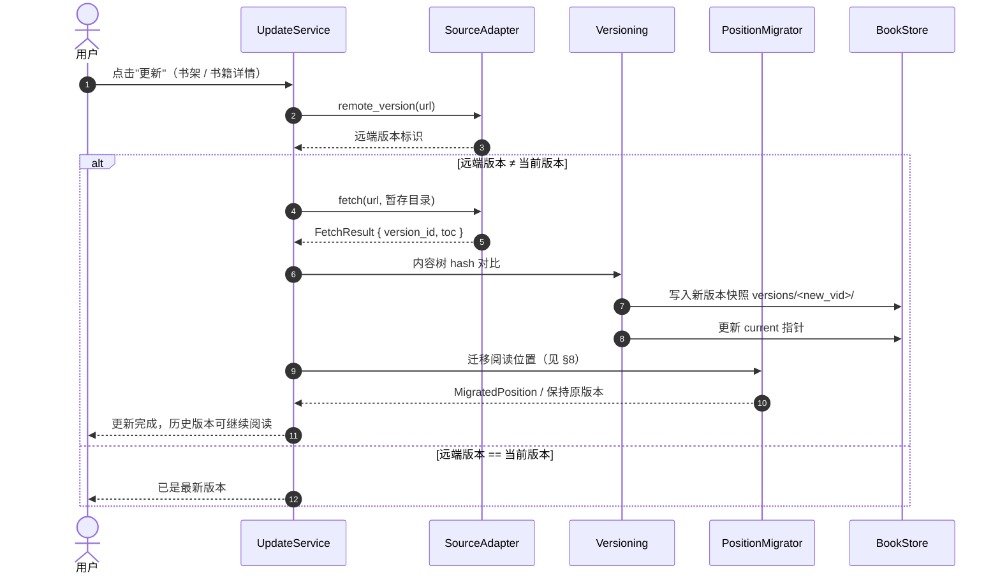
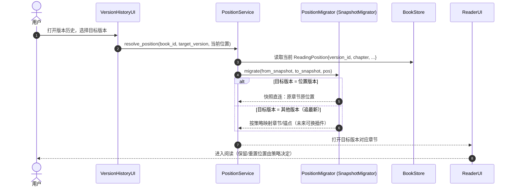

# mdor 项目架构文档

> 移动端 mdBook 离线阅读器 · Android · Rust + Dioxus
> 版本：0.1.0（规划稿）

---

## 1. 项目概述

### 1.1 目标

构建一个 **Android 移动端 mdBook 阅读器**，核心能力：

- 通过 **网址** 将远程文档下载到本地，离线阅读
- 支持两类输入来源：**GitHub 仓库（markdown 源文件）** 与 **托管静态站点（渲染好的 HTML）**
- 通过 **网址更新** 文档，并保留版本历史
- 记录 **阅读位置**（章节 + 滚动位置），支持书籍多版本阅读

### 1.2 技术栈

| 项 | 选择 | 说明 |
|---|---|---|
| 语言 | Rust (edition 2024) | 当前 1.97.1 |
| UI 框架 | Dioxus 0.7 | WebView 渲染，Android 一级支持 |
| 构建 | dioxus-cli (`dx`) | `dx serve --platform android` |
| HTTP | reqwest (rustls) | Android 无 OpenSSL 依赖 |
| HTML 解析 | scraper | 抽取 mdBook `<main>` 内容 |
| Markdown | pulldown-cmark | 渲染 GitHub markdown 源 |
| 序列化 | serde / serde_json | 元数据与进度存储 |
| 存储 | 本地文件系统 | JSON + 版本快照目录 |

### 1.3 非目标

- 不内嵌 mdBook 构建流程（不在设备上跑 `mdbook build`）
- 不做在线搜索 / 云同步（首版）
- 不做 iOS（Windows 平台无法构建）

---

## 2. 设计原则

1. **插件化输入**：所有文档来源（GitHub、静态站点、未来更多）通过统一的 `SourceAdapter` trait 接入，核心逻辑不感知来源差异。
2. **核心与 UI 解耦**：`core/` 为纯 Rust、平台无关，可在桌面直接 `cargo test`；`ui/` 为 Dioxus 界面。
3. **离线优先**：所有内容必须先落盘才可阅读，网络仅用于获取与更新。
4. **版本感知**：书籍按版本快照管理，阅读位置与具体版本强绑定，永不因更新而丢失。
5. **位置迁移可插拔**：版本间的阅读位置跳转策略也做成插件，当前唯一实现为"快照直连"，后续可扩展其他策略。

---

## 3. 总体架构

### 3.1 架构分层

```
┌──────────────────────────────────────────────────────────────┐
│                      UI 层 (Dioxus RSX)                      │
│   书架 LibraryUI · 添加 AddBookUI · 阅读 ReaderUI · 版本历史 │
├──────────────────────────────────────────────────────────────┤
│                      服务层 (Rust)                           │
│   BookManager · SourceRegistry · UpdateService               │
│   PositionService · RenderService                            │
├──────────────────────────────────────────────────────────────┤
│                      核心/插件层 (Rust)                      │
│   StaticSiteSource · GitHubSource      (输入适配插件)        │
│   SnapshotMigrator (+ 预留迁移插件)     (位置迁移插件)       │
│   Versioning · BookStore               (核心能力)            │
├──────────────────────────────────────────────────────────────┤
│                      设备存储 (本地文件系统)                 │
│   library.json · progress.json · books/<id>/versions/<vid>/  │
└──────────────────────────────────────────────────────────────┘
```
### 3.2 C4 组件图



> 该图由 LikeC4 建模生成，源文件见 `doc/mdor.c4`（再生成：`likec4 gen mermaid doc -o <输出目录>`）。

---

## 4. 插件化输入架构

所有文档来源抽象为统一的 `SourceAdapter` trait，输入模块即为"插件"，通过 `SourceRegistry` 注册、按 URL 探测。

```rust
// core/source/mod.rs
#[derive(Clone, Copy, Debug, serde::Serialize, serde::Deserialize, PartialEq, Eq)]
pub enum SourceKind {
    StaticSite, // 托管静态站点：镜像 HTML
    GitHub,     // GitHub 仓库：拉取 markdown 源
}

#[async_trait]
pub trait SourceAdapter: Send + Sync {
    fn kind(&self) -> SourceKind;
    fn name(&self) -> &'static str;

    /// 探测：该适配器是否认识这个 URL
    fn detect(&self, url: &str) -> bool;

    /// 获取/刷新：从 URL 拉取内容写入 dest，返回书籍结构与版本标识
    async fn fetch(&self, url: &str, dest: &Path) -> Result<FetchResult>;

    /// 版本标识：返回当前远端版本字符串（GitHub: commit SHA；静态站: ETag/内容树 hash）
    async fn remote_version(&self, url: &str) -> Result<Option<String>>;
}

pub struct FetchResult {
    pub version_id: String,
    pub book: BookInfo,
    pub toc: Vec<TocEntry>,
}
```

### 4.1 内置适配器

| 适配器 | 输入 | 处理方式 |
|---|---|---|
| `StaticSiteSource` | `https://host/book/...` | 递归镜像同源页面/资源，保 mdBook 目录结构，抽取 `<main>` |
| `GitHubSource` | `https://github.com/user/repo[/tree/...]` | 解析 `src/SUMMARY.md` 建 TOC，下载 `.md`+静态资源，`pulldown-cmark` 渲染 |

### 4.2 添加书籍流程（序列图 SD-1）



---

## 5. 数据模型

```rust
/// 书架上的书籍元数据（library.json 中每条）
#[derive(Serialize, Deserialize, Clone)]
pub struct Book {
    pub id: String,              // book_id，由来源 URL 派生
    pub source_kind: SourceKind,
    pub url: String,             // 原始网址（用于更新）
    pub title: String,
    pub current_version: String, // 当前版本（current 指针）
    pub added_at: i64,
    pub updated_at: i64,
}

/// 一次获取的内容快照（书籍的一个版本）
pub struct VersionSnapshot {
    pub version_id: String,
    pub root: PathBuf,           // books/<id>/versions/<vid>/
    pub toc: Vec<TocEntry>,      // 章节树
    pub meta: SnapshotMeta,      // 获取时间、来源版本标识、内容树 hash
}

/// 阅读位置 —— 与具体版本强绑定
#[derive(Serialize, Deserialize, Clone)]
pub struct ReadingPosition {
    pub book_id: String,
    pub version_id: String,      // 位置所属版本（快照直连的关键）
    pub chapter_path: String,    // 章节路径（TOC 中的相对路径）
    pub heading_anchor: Option<String>, // 标题锚点（mdBook 输出自带）
    pub scroll_ratio: f32,       // 章节内滚动比例 0.0~1.0
    pub saved_at: i64,
}

/// 位置迁移结果
pub struct MigratedPosition {
    pub target_version: String,
    pub target_chapter: String,
    pub target_anchor: Option<String>,
    pub strategy: MigrateStrategy, // 见 §8
}
```

---

## 6. 核心模块

### 6.1 BookManager
书籍生命周期编排：`add_book`、`remove_book`、`update_book`。不感知来源差异，统一走 `SourceRegistry` + `Versioning`。

### 6.2 SourceRegistry
注册表 + 工厂：持有 `Vec<Box<dyn SourceAdapter>>`，`detect(url)` 依次询问。新增来源 = 新增一个实现 `SourceAdapter` 的插件模块并注册，核心与 UI 零改动。

### 6.3 UpdateService
更新编排（见 §7）。

### 6.4 PositionService
阅读位置读写（`progress.json`），以及调用 `PositionMigrator` 完成版本间位置迁移（见 §8）。

### 6.5 RenderService
统一渲染管线：
- `StaticSite` 路径：读取章节 HTML → `scraper` 抽取 `<main id="content">` → 重写资源链接为本地协议 `mdor-book://` → `dangerous_inner_html` 注入
- `GitHub` 路径：读取 `.md` → `pulldown-cmark` → HTML → 同一注入管线
- 内联书籍 CSS，保证代码高亮等样式一致

### 6.6 离线阅读 + 进度恢复（序列图 SD-2）



---

## 7. 版本控制设计

### 7.1 版本标识

| 来源 | 版本标识来源 | 说明 |
|---|---|---|
| GitHub | commit SHA | 通过 GitHub API 获取 HEAD commit |
| 静态站点 | ETag / Last-Modified + 内容树 hash | 镜像后对全站文件计算内容树 hash，唯一标识 |

### 7.2 快照模型

- 每次内容有变化的获取都会生成一个新版本快照：`books/<id>/versions/<version_id>/`
- `current` 指针标记最新版本；历史快照保留，供多版本阅读
- 内容 hash 未变化时不新建快照，复用旧版本

### 7.3 更新流程（序列图 SD-3）



---

## 8. 阅读位置在版本变动后的处理方案

### 8.1 设计决策

**方案 D（版本快照）为当前正式且唯一的方式**。阅读位置与具体版本强绑定：

- 记录时绑定 `version_id`（该记录的位置必然可回放）
- 更新后，位置仍指向旧版本快照；用户从书架打开时，**默认继续读旧版本快照对应位置**，进度零丢失
- 项目支持同一文档**多版本并行阅读**（版本历史界面选择任意版本）

### 8.2 插件化迁移架构

实际"跳转"行为做成插件，未来可让用户选择不同策略。当前内置唯一实现，后续逐个加入。

```rust
// core/migration/mod.rs
#[async_trait]
pub trait PositionMigrator: Send + Sync {
    fn id(&self) -> &'static str;
    fn name(&self) -> &'static str;
    /// 将旧版本位置迁移到目标版本（可能返回"保持旧版本"）
    async fn migrate(
        &self,
        from: &VersionSnapshot,
        to: &VersionSnapshot,
        pos: &ReadingPosition,
    ) -> Result<MigratedPosition>;
}
```

### 8.3 插件清单

| 插件 id | 名称 | 状态 | 行为 |
|---|---|---|---|
| `snapshot` | SnapshotMigrator | **内置（当前唯一）** | 位置绑定旧版，旧快照仍在 → 迁移结果即"读旧版原位置"；若用户选择追最新，则按 TOC 同名路径映射 |
| `path` | PathMigrator | 预留 | 按 `chapter_path` 直接映射到新版本，路径消失则 TOC 顺序回退相邻章节 |
| `anchor` | AnchorMigrator | 预留 | 增加标题锚点映射，锚点消失回退章节开头，标题改动用模糊匹配 |
| `fingerprint` | FingerprintMigrator | 预留 | 记录阅读位置附近文本指纹，新版本全文检索命中后精确定位 |

> 多版本阅读 + 快照直连（方案 D）保证"永不丢位置"；其余插件是"用户主动追最新版"时的可选策略，将来通过设置界面选择。

### 8.4 版本切换 / 位置迁移（序列图 SD-4）



---

## 9. 存储布局

```
<app data dir>/
├── library.json                 # 书架元数据（Book 列表 + current 指针）
├── progress.json                # 阅读位置（ReadingPosition 按 book_id 索引）
└── books/
    └── <book_id>/
        └── versions/
            ├── <version_id>/
            │   ├── meta.json    # SnapshotMeta：来源版本标识、内容树 hash、时间
            │   ├── toc.json     # 章节树
            │   └── site/        # 内容：静态站为镜像 HTML；GitHub 为 md 源 + 渲染缓存
            └── current          # 文本文件，内容为当前 version_id
```

> Android 下根目录通过 `android_activity`/JNI 取 `getFilesDir()`；桌面开发回退到用户数据目录，便于 `cargo test` 与调试。

---

## 10. 里程碑

| 阶段 | 内容 | 验证方式 |
|---|---|---|
| **M0** | Android 环境搭建（SDK/NDK/JDK、rustup android targets、dioxus-cli） | `dx serve --platform desktop` 跑通 |
| **M1** | 脚手架：core 模块 + trait + 存储层 + 书架骨架（中文 UI） | `cargo run` / `cargo test` |
| **M2** | `StaticSiteSource` + 递归镜像下载 | 用真实 mdBook 站点离线镜像 |
| **M3** | 阅读器：内容抽取、资源协议、目录抽屉、滚动进度 | 桌面全流程 |
| **M4** | `GitHubSource`：SUMMARY 解析 + markdown 下载渲染 | 真实仓库测试 |
| **M5** | 版本控制 + 多版本阅读 + SnapshotMigrator（方案 D） | 修改源站后更新，验证位置不丢 |
| **M6** | Android 打包（APK）、权限/存储目录/cleartext 配置 | 模拟器/真机验证 |

---

## 11. 风险与待定项

| 风险/待定 | 影响 | 应对 |
|---|---|---|
| wry 自定义协议在 Android 的兼容性 | 阅读页图片/资源加载 | 备选：内嵌本地 `tiny_http` 服务器 |
| Android 数据目录获取 | 存储路径 | JNI `getFilesDir()`；桌面回退 |
| mdBook 高级扩展（`{{#playground}}`、LaTeX、mermaid） | GitHub 源渲染保真度 | 首版仅支持 `{{#include}}`，其余列出 |
| `dangerous_inner_html` 不执行 `<script>` | 搜索/导航原生 JS 失效 | 由 Dioxus 自绘 TOC/导航替代（预期行为） |
| 多版本快照的存储占用 | 设备空间 | 后续加"保留最近 N 版"清理策略 |
| 静态站点镜像边界 | 防止越界爬取 | 限同源 + 深度/大小上限 |

---

*本文件为架构规划稿，随实现推进持续更新。*

